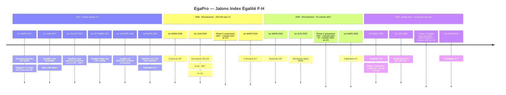
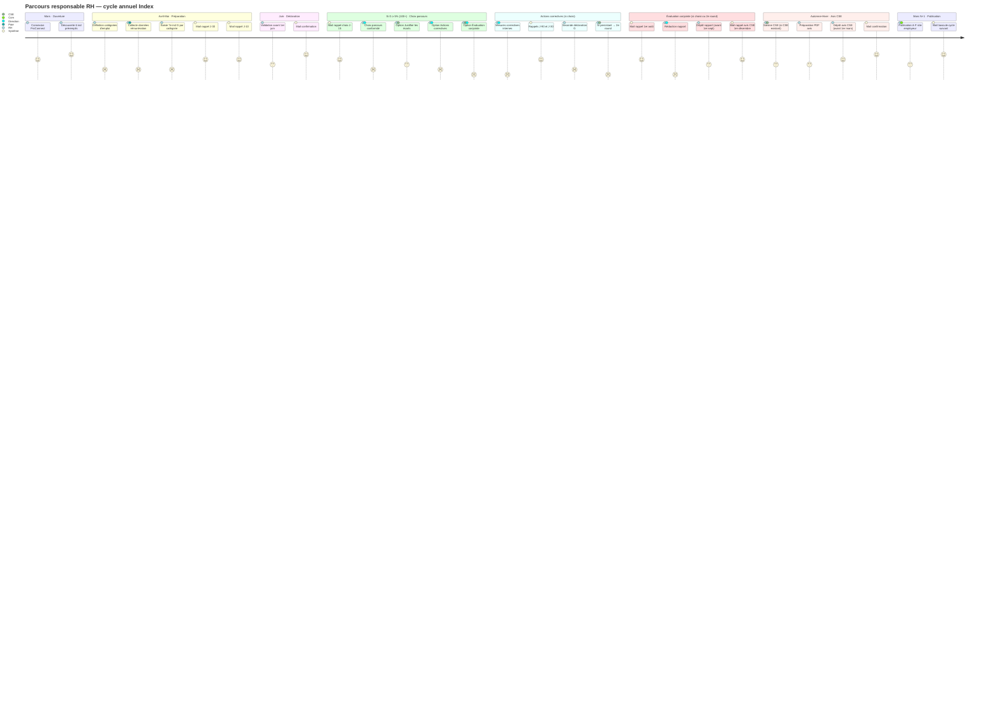

> **Source métier** : [EgaPro](https://egapro.travail.gouv.fr) — Index égalité professionnelle F-H (Directive UE 2023/970).
> **Légende** : 🟣 mail système · 🩷 action entreprise · 🟦 process plateforme · 🟢 jalon · 🟡 décision · ⬜ note/inactif · 🔹 paramètre conditionnel
> **Structure** : 1 tableau paramètres + 4 flowcharts année (2027-2030) + Timeline + Gantt + Journey RH + Flux Phase 2 par année.
> **Convention** : les chemins sont volontairement dupliqués pour la lisibilité. Dépôt avis CSE + confirmation uniquement si l'entreprise a un CSE (fork "A CSE ?" sur tous les chemins 100+). Plus de logique 31 décembre : deadline finale = 1er mars N+1.

---

## 1. Paramètres du parcours par tranche × année

| Tranche | 6 ind A-F | 7e ind G | CSE | Entrée en vigueur obligation |
|---|---|---|---|---|
| &lt; 50 | Volontaire (saisie manuelle) | Volontaire | Pas de CSE | — (volontaire permanent) |
| 50 – 99 | **Obligatoire** dès 2027 | **Obligatoire dès 2030** · Pas de Phase 2 (pas CSE) | Pas de CSE (interdit) | **2027** (6 ind) · **2030** (7e ind) |
| 100 – 149 | **Obligatoire** dès 2027 | **Obligatoire dès 2030** · Triennal | CSE si existant | **2027** (6 ind) · **2030** (7e ind) |
| 150 – 249 | Obligatoire dès 2027 | Obligatoire · Triennal (2027, 2030, 2033…) | CSE si existant | 2027 |
| 250 – 999 | Obligatoire dès 2027 | Obligatoire · Annuel | CSE si existant | 2027 |
| + 1000 | Obligatoire dès 2027 | Obligatoire · Annuel | CSE si existant | 2027 |

**Règles clés :**

- Tous les 50+ déclarent les 6 ind A-F chaque année dès 2027 (obligatoire · sanctionnable).
- Le 7e ind G devient obligatoire pour 50-99 et 100-149 seulement à partir de 2030.
- Phase 2 (parcours conformité) déclenchée uniquement si les 3 conditions cumulées : **100+** · **7e ind G calculé** · **écart G ≥ 5%**.
- 50-99 n'entre jamais en Phase 2 (pas de CSE, donc pas de consultation possible), même si G ≥ 5% (2030+).
- Avis CSE déposé uniquement si l'entreprise a effectivement un CSE constitué.
- Deadline finale de dépôt avis CSE + publication = **1er mars N+1** (sauf Justifier : 1er octobre N).
- Pas de mail d'ouverture en 2027 (première année · pas de base utilisateurs).

---

## 2. Flowchart complet 2027

Entrée en vigueur V2 — toutes tranches ≥ 50 obligatoires pour les 6 ind A–F. 7e ind G obligatoire pour 150+ (triennal an 1 pour 150-249 · annuel pour 250+), pas de 7e pour 50-149. Pas de mail d'ouverture (première année). Dépôt avis CSE + confirmation uniquement si CSE existant (fork "A CSE ?" sur tous les chemins). Deadlines spécifiques par chemin (Justifier 1er oct · Éval conjointe 1er sept rapport / 1er mars 2028 avis CSE · Actions correctives 1er jan 2028 / 1er mars 2028). Chemins volontairement dupliqués pour la lisibilité.

```mermaid
flowchart TB
    Y["ANNÉE 2027 — Entrée en vigueur V2"]:::year

    %% ─── Tranches ───
    Y --> C1["&lt; 50<br/>(volontaire)"]:::colVol
    Y --> C2["50 – 99<br/>(oblig · 6 ind · pas CSE)"]:::col
    Y --> C3["100 – 149<br/>(oblig · 6 ind · CSE si existant)"]:::col
    Y --> C4["150 – 249<br/>(oblig · 6+7e · CSE si existant)"]:::col
    Y --> C5["250 – 999<br/>(oblig · 6+7e · CSE si existant)"]:::col
    Y --> C6["+ 1000<br/>(oblig · 6+7e · CSE si existant)"]:::col

    %% ─── Chemin 1 : <50 volontaire ───
    C1 --> VOL["Parcours volontaire<br/>Saisie manuelle 7 ind · Pas CSE"]:::note
    VOL --> VEND(["FIN volontaire"]):::fin

    %% ─── Phase 1 commune (50+) ───
    C2 --> P0
    C3 --> P0
    C4 --> P0
    C5 --> P0
    C6 --> P0

    P0["1er MARS — Ouverture données GIP (DSN)"]:::green
    P0 --> P1["Préremplissage 6 ind A–F (auto)"]:::pink
    P1 --> P2d{"150+ ?"}:::diamond
    P2d -- "OUI (150+)" --> P2["Saisie 7e ind G<br/>(150-249 triennal an 1 · 250+ annuel)"]:::pink
    P2d -- "NON (50-149)<br/>Pas de 7e ind" --> P3
    P2 --> P3["Complétion des indicateurs<br/>(jusqu'au 1er juin)"]:::blue
    P3 --> MR30["📧 Mail rappel échéance J-30<br/>(avant 1er juin)"]:::mail
    MR30 --> MR10["📧 Mail rappel échéance J-10<br/>(avant 1er juin)"]:::mail
    MR10 --> P4["1er JUIN — Deadline 1ère déclaration"]:::green
    P4 --> S_P1["📋 Déclaration soumise"]:::state
    S_P1 --> MD["📧 Mail confirmation 1ère déclaration"]:::mail

    %% ─── Routage post-Phase 1 par tranche ───
    MD --> TR2{"Tranche ?"}:::diamond

    %% ─── Chemin 2 : 50-99 (pas de CSE) ───
    TR2 -- "50-99" --> PUB_50["Publication A–F publique<br/>(G confidentiel)<br/>Pas de CSE"]:::blue
    PUB_50 --> MI_50["📧 Mail bascule cycle 2028"]:::mail
    MI_50 --> END_50(["FIN · reconduction 2028"]):::fin

    %% ─── Chemin 3 : 100-149 ───
    TR2 -- "100-149" --> HC_B{"A CSE ?"}:::diamond
    HC_B -- "OUI" --> MG_B["📧 Mail rappel avis CSE<br/>(exactitude données)<br/>avant 1er mars 2028"]:::mail
    MG_B --> CSE_B["Dépôt avis CSE<br/>(exactitude des données)"]:::pink
    CSE_B --> S_B["📋 Avis CSE soumis"]:::state
    S_B --> MH_B["📧 Mail confirmation avis CSE"]:::mail
    MH_B --> PUB_B["Publication A–F publique<br/>(G confidentiel)"]:::blue
    HC_B -- "NON" --> PUB_Bn["Publication A–F publique<br/>(G confidentiel)<br/>Pas de CSE"]:::blue
    PUB_B --> MI_B["📧 Mail bascule cycle 2028"]:::mail
    PUB_Bn --> MI_Bn["📧 Mail bascule cycle 2028"]:::mail
    MI_B --> END_B(["FIN · reconduction 2028"]):::fin
    MI_Bn --> END_Bn(["FIN · reconduction 2028"]):::fin

    %% ─── Chemin 4 : 150+ → évaluation G ───
    TR2 -- "150+" --> G1{"Écart G ≥ 5% ?"}:::diamond

    %% ─── Chemin 4a : 150+ conforme (G < 5%) ───
    G1 -- "NON (conforme)" --> HC_C{"A CSE ?"}:::diamond
    HC_C -- "OUI" --> MG_C["📧 Mail rappel avis CSE<br/>(exactitude données)<br/>avant 1er mars 2028"]:::mail
    MG_C --> CSE_C["Dépôt avis CSE<br/>(exactitude des données)"]:::pink
    CSE_C --> S_C["📋 Avis CSE soumis"]:::state
    S_C --> MH_C["📧 Mail confirmation avis CSE"]:::mail
    MH_C --> PUB_C["Publication A–F publique<br/>(G confidentiel)"]:::blue
    HC_C -- "NON" --> PUB_Cn["Publication A–F publique<br/>(G confidentiel)<br/>Pas de CSE"]:::blue
    PUB_C --> MI_C["📧 Mail bascule cycle 2028"]:::mail
    PUB_Cn --> MI_Cn["📧 Mail bascule cycle 2028"]:::mail
    MI_C --> END_C(["FIN · reconduction 2028"]):::fin
    MI_Cn --> END_Cn(["FIN · reconduction 2028"]):::fin

    %% ─── Chemin 4b : 150+ G ≥ 5% → Phase 2 ───
    G1 -- "OUI (G ≥ 5%)" --> ME["📧 Mail rappel choix parcours<br/>(J-15 avant 1er juillet)"]:::mail
    ME --> CHOIX["Choix parcours conformité<br/>(deadline 1er juillet)"]:::pink
    CHOIX --> PJ["🛡️ Justifier les écarts"]:::variantPath
    CHOIX --> PA["🔧 Actions correctives"]:::variantPath
    CHOIX --> PE["🤝 Évaluation conjointe"]:::variantPath

    %% ─── Chemin 4b-J : Justifier (dépôt 1er oct · rappel 1er déc si pas déposé) ───
    PJ --> HC_J{"A CSE ?"}:::diamond
    HC_J -- "OUI" --> MG_J1["📧 Mail rappel avis CSE<br/>(exactitude + justif. écarts)<br/>avant 1er octobre"]:::mail
    MG_J1 --> CSE_J["Dépôt avis CSE<br/>(exactitude + justification écarts)<br/>deadline 1er octobre"]:::pink
    CSE_J --> MG_J2["📧 Mail rappel 1er décembre<br/>(si pas encore déposé)"]:::mail
    MG_J2 --> S_J["📋 Avis CSE soumis"]:::state
    S_J --> MH_J["📧 Mail confirmation avis CSE"]:::mail
    MH_J --> PUB_J["Publication A–F publique<br/>(G confidentiel)"]:::blue
    HC_J -- "NON" --> PUB_Jn["Publication A–F publique<br/>(G confidentiel)<br/>Pas de CSE"]:::blue
    PUB_J --> MI_J["📧 Mail bascule cycle 2028"]:::mail
    PUB_Jn --> MI_Jn["📧 Mail bascule cycle 2028"]:::mail
    MI_J --> END_J(["FIN · reconduction 2028"]):::fin
    MI_Jn --> END_Jn(["FIN · reconduction 2028"]):::fin

    %% ─── Chemin 4b-A : Actions correctives (J-90 + J-30) ───
    PA --> MSD3["📧 Mail rappel 2e décl J-90"]:::mail
    MSD3 --> MSD30["📧 Mail rappel 2e décl J-30 (1er déc 2027)"]:::mail
    MSD30 --> PA2["Seconde déclaration G<br/>(deadline 1er janvier 2028)"]:::pink
    PA2 --> S_PA2["📋 2e déclaration soumise"]:::state
    S_PA2 --> MSDc["📧 Mail confirmation 2e déclaration"]:::mail
    MSDc --> PAG{"Écarts encore ≥ 5% ?"}:::diamond
    PAG -- "OUI (persistant)" --> R2["2e round<br/>(Justifier ou Éval. conjointe)"]:::pink
    R2 --> PJ
    R2 --> PE
    PAG -- "NON (corrigé)" --> HC_A{"A CSE ?"}:::diamond
    HC_A -- "OUI" --> MG_A["📧 Mail rappel avis CSE<br/>(exactitude 1ère + 2e décl<br/>+ justif. écarts si applicable)<br/>avant 1er mars 2028"]:::mail
    MG_A --> CSE_A["Dépôt avis CSE<br/>(exactitude 1ère et 2e déclaration<br/>+ justification des écarts si applicable)"]:::pink
    CSE_A --> S_A["📋 Avis CSE soumis"]:::state
    S_A --> MH_A["📧 Mail confirmation avis CSE"]:::mail
    MH_A --> PUB_A["Publication A–F publique<br/>(G confidentiel)"]:::blue
    HC_A -- "NON" --> PUB_An["Publication A–F publique<br/>(G confidentiel)<br/>Pas de CSE"]:::blue
    PUB_A --> MI_A["📧 Mail bascule cycle 2028"]:::mail
    PUB_An --> MI_An["📧 Mail bascule cycle 2028"]:::mail
    MI_A --> END_A(["FIN · reconduction 2028"]):::fin
    MI_An --> END_An(["FIN · reconduction 2028"]):::fin

    %% ─── Chemin 4b-E : Évaluation conjointe (mail 1er août · rapport 1er sept · rappel CSE 1er déc) ───
    PE --> MG_E1["📧 Mail rappel dépôt éval. conjointe<br/>(envoyé 1er août)"]:::mail
    MG_E1 --> PE2["Dépôt rapport évaluation conjointe<br/>(deadline 1er septembre)"]:::pink
    PE2 --> S_PE2["📋 Évaluation conjointe soumise"]:::state
    S_PE2 --> M_PE2["📧 Mail confirmation rapport éval. conjointe"]:::mail
    M_PE2 --> HC_E{"A CSE ?"}:::diamond
    HC_E -- "OUI" --> MG_E2["📧 Mail rappel avis CSE<br/>(exactitude + éval. conjointe)<br/>envoyé 1er décembre"]:::mail
    MG_E2 --> CSE_E["Dépôt avis CSE<br/>(exactitude + évaluation conjointe)<br/>avant 1er mars 2028"]:::pink
    CSE_E --> S_E["📋 Avis CSE soumis"]:::state
    S_E --> MH_E["📧 Mail confirmation avis CSE"]:::mail
    MH_E --> PUB_E["Publication A–F publique<br/>(G confidentiel)"]:::blue
    HC_E -- "NON" --> PUB_En["Publication A–F publique<br/>(G confidentiel)<br/>Pas de CSE"]:::blue
    PUB_E --> MI_E["📧 Mail bascule cycle 2028"]:::mail
    PUB_En --> MI_En["📧 Mail bascule cycle 2028"]:::mail
    MI_E --> END_E(["FIN · reconduction 2028"]):::fin
    MI_En --> END_En(["FIN · reconduction 2028"]):::fin

    classDef year   fill:#fff2a8,stroke:#b59e00,color:#000,font-weight:bold
    classDef col    fill:#cfe3ff,stroke:#2d5fa8,color:#000
    classDef colVol fill:#fff6c9,stroke:#a88a2d,color:#000
    classDef pink   fill:#ffc6d3,stroke:#a83a5b,color:#000
    classDef green  fill:#c9f0a1,stroke:#3b7a1d,color:#000
    classDef blue   fill:#9ec9ff,stroke:#1f4e8a,color:#000
    classDef note   fill:#e8e8e8,stroke:#777,color:#000,font-style:italic
    classDef diamond fill:#ffe48f,stroke:#a56f00,color:#000
    classDef mail   fill:#e3d5ff,stroke:#6a3db7,color:#000
    classDef state  fill:#c5e8e0,stroke:#0a7a6a,color:#000,font-weight:bold
    classDef variantPath fill:#fff6c9,stroke:#a88a2d,color:#000,font-weight:bold
    classDef fin    fill:#c9f0a1,stroke:#3b7a1d,color:#000,font-weight:bold
```

### 2.bis Vue avec statuts FSM (en construction)

> Clone du flowchart 2027 ci-dessus, sur lequel on superposera progressivement les statuts FSM (`status` enum issu du ticket #3144) à chaque jalon. Pour l'instant identique au flowchart de référence.

```mermaid
flowchart TB
    Y["ANNÉE 2027 — Entrée en vigueur V2"]:::year

    %% ─── Tranches ───
    Y --> C1["&lt; 50<br/>(volontaire)"]:::colVol
    Y --> C2["50 – 99<br/>(oblig · 6 ind · pas CSE)"]:::col
    Y --> C3["100 – 149<br/>(oblig · 6 ind · CSE si existant)"]:::col
    Y --> C4["150 – 249<br/>(oblig · 6+7e · CSE si existant)"]:::col
    Y --> C5["250 – 999<br/>(oblig · 6+7e · CSE si existant)"]:::col
    Y --> C6["+ 1000<br/>(oblig · 6+7e · CSE si existant)"]:::col

    %% ─── Chemin 1 : <50 volontaire ───
    C1 --> VOL["Parcours volontaire<br/>Saisie manuelle 7 ind · Pas CSE"]:::note
    VOL --> VEND(["FIN volontaire"]):::fin

    %% ─── Phase 1 commune (50+) ───
    C2 --> P0
    C3 --> P0
    C4 --> P0
    C5 --> P0
    C6 --> P0

    P0["1er MARS — Ouverture données GIP (DSN)"]:::green
    P0 --> P1["Préremplissage 6 ind A–F (auto)"]:::pink
    P1 --> P2d{"150+ ?"}:::diamond
    P2d -- "OUI (150+)" --> P2["Saisie 7e ind G<br/>(150-249 triennal an 1 · 250+ annuel)"]:::pink
    P2d -- "NON (50-149)<br/>Pas de 7e ind" --> P3
    P2 --> P3["Complétion des indicateurs<br/>(jusqu'au 1er juin)"]:::blue
    P3 --> MR30["📧 Mail rappel échéance J-30<br/>(avant 1er juin)"]:::mail
    MR30 --> MR10["📧 Mail rappel échéance J-10<br/>(avant 1er juin)"]:::mail
    MR10 --> P4["1er JUIN — Deadline 1ère déclaration"]:::green
    P4 --> SAVE_EFF["Validation d'une donnée par l'utilisateur<br/>« Sauvegarde des Effectifs »"]:::pink
    SAVE_EFF --> ST1_PROG["🟡 Déclaration des indicateurs<br/>de rémunération — En cours"]:::stageInProgress
    ST1_PROG --> S_P1["📋 Déclaration soumise"]:::state
    S_P1 --> ST1_DONE["✅ Déclaration des indicateurs<br/>de rémunération — Effectuée"]:::stageDone
    ST1_DONE --> MD["📧 Mail confirmation 1ère déclaration"]:::mail

    %% ─── Routage post-Phase 1 par tranche ───
    MD --> TR2{"Tranche ?"}:::diamond

    %% ─── Chemin 2 : 50-99 (pas de CSE) ───
    TR2 -- "50-99" --> ST7_50_DONE["✅ Finalisation - Démarche des<br/>indicateurs de rémunération — Effectuée"]:::stageDone
    ST7_50_DONE --> PUB_50["Publication A–F publique<br/>(G confidentiel)<br/>Pas de CSE"]:::blue
    PUB_50 --> MI_50["📧 Mail bascule cycle 2028"]:::mail
    MI_50 --> END_50(["FIN · reconduction 2028"]):::fin

    %% ─── Chemin 3 : 100-149 ───
    TR2 -- "100-149" --> HC_B{"A CSE ?"}:::diamond
    HC_B -- "OUI" --> ST6B_PROG["🟡 Déposer le ou les<br/>avis CSE — En cours"]:::stageInProgress
    ST6B_PROG --> MG_B["📧 Mail rappel avis CSE<br/>(exactitude données)<br/>avant 1er mars 2028"]:::mail
    MG_B --> CSE_B["Dépôt avis CSE<br/>(exactitude des données)"]:::pink
    CSE_B --> S_B["📋 Avis CSE soumis"]:::state
    S_B --> ST6B_DONE["✅ Déposer le ou les<br/>avis CSE — Effectuée"]:::stageDone
    ST6B_DONE --> ST7B_DONE["✅ Finalisation - Démarche des<br/>indicateurs de rémunération — Effectuée"]:::stageDone
    ST7B_DONE --> MH_B["📧 Mail confirmation avis CSE"]:::mail
    MH_B --> PUB_B["Publication A–F publique<br/>(G confidentiel)"]:::blue
    HC_B -- "NON" --> ST7Bn_DONE["✅ Finalisation - Démarche des<br/>indicateurs de rémunération — Effectuée"]:::stageDone
    ST7Bn_DONE --> PUB_Bn["Publication A–F publique<br/>(G confidentiel)<br/>Pas de CSE"]:::blue
    PUB_B --> MI_B["📧 Mail bascule cycle 2028"]:::mail
    PUB_Bn --> MI_Bn["📧 Mail bascule cycle 2028"]:::mail
    MI_B --> END_B(["FIN · reconduction 2028"]):::fin
    MI_Bn --> END_Bn(["FIN · reconduction 2028"]):::fin

    %% ─── Chemin 4 : 150+ → évaluation G ───
    TR2 -- "150+" --> G1{"Écart G ≥ 5% ?"}:::diamond

    %% ─── Chemin 4a : 150+ conforme (G < 5%) ───
    G1 -- "NON (conforme)" --> HC_C{"A CSE ?"}:::diamond
    HC_C -- "OUI" --> ST6C_PROG["🟡 Déposer le ou les<br/>avis CSE — En cours"]:::stageInProgress
    ST6C_PROG --> MG_C["📧 Mail rappel avis CSE<br/>(exactitude données)<br/>avant 1er mars 2028"]:::mail
    MG_C --> CSE_C["Dépôt avis CSE<br/>(exactitude des données)"]:::pink
    CSE_C --> S_C["📋 Avis CSE soumis"]:::state
    S_C --> ST6C_DONE["✅ Déposer le ou les<br/>avis CSE — Effectuée"]:::stageDone
    ST6C_DONE --> ST7C_DONE["✅ Finalisation - Démarche des<br/>indicateurs de rémunération — Effectuée"]:::stageDone
    ST7C_DONE --> MH_C["📧 Mail confirmation avis CSE"]:::mail
    MH_C --> PUB_C["Publication A–F publique<br/>(G confidentiel)"]:::blue
    HC_C -- "NON" --> ST7Cn_DONE["✅ Finalisation - Démarche des<br/>indicateurs de rémunération — Effectuée"]:::stageDone
    ST7Cn_DONE --> PUB_Cn["Publication A–F publique<br/>(G confidentiel)<br/>Pas de CSE"]:::blue
    PUB_C --> MI_C["📧 Mail bascule cycle 2028"]:::mail
    PUB_Cn --> MI_Cn["📧 Mail bascule cycle 2028"]:::mail
    MI_C --> END_C(["FIN · reconduction 2028"]):::fin
    MI_Cn --> END_Cn(["FIN · reconduction 2028"]):::fin

    %% ─── Chemin 4b : 150+ G ≥ 5% → Phase 2 ───
    G1 -- "OUI (G ≥ 5%)" --> ME["📧 Mail rappel choix parcours<br/>(J-15 avant 1er juillet)"]:::mail
    ME --> ST2_PROG["🟡 (1ère déclaration) Choix du parcours<br/>de mise en conformité — En cours"]:::stageInProgress
    ST2_PROG --> CHOIX["Choix parcours conformité<br/>(deadline 1er juillet)"]:::pink
    CHOIX --> ST2_DONE["✅ (1ère déclaration) Choix du parcours<br/>de mise en conformité — Effectuée"]:::stageDone
    ST2_DONE --> PJ["🛡️ Justifier les écarts"]:::variantPath
    ST2_DONE --> PA["🔧 Actions correctives"]:::variantPath
    ST2_DONE --> PE["🤝 Évaluation conjointe"]:::variantPath

    %% ─── Chemin 4b-J : Justifier (dépôt 1er oct · rappel 1er déc si pas déposé) ───
    PJ --> HC_J{"A CSE ?"}:::diamond
    HC_J -- "OUI" --> ST6J_PROG["🟡 Déposer le ou les<br/>avis CSE — En cours"]:::stageInProgress
    ST6J_PROG --> MG_J1["📧 Mail rappel avis CSE<br/>(exactitude + justif. écarts)<br/>avant 1er octobre"]:::mail
    MG_J1 --> CSE_J["Dépôt avis CSE<br/>(exactitude + justification écarts)<br/>deadline 1er octobre"]:::pink
    CSE_J --> MG_J2["📧 Mail rappel 1er décembre<br/>(si pas encore déposé)"]:::mail
    MG_J2 --> S_J["📋 Avis CSE soumis"]:::state
    S_J --> ST6J_DONE["✅ Déposer le ou les<br/>avis CSE — Effectuée"]:::stageDone
    ST6J_DONE --> ST7J_DONE["✅ Finalisation - Démarche des<br/>indicateurs de rémunération — Effectuée"]:::stageDone
    ST7J_DONE --> MH_J["📧 Mail confirmation avis CSE"]:::mail
    MH_J --> PUB_J["Publication A–F publique<br/>(G confidentiel)"]:::blue
    HC_J -- "NON" --> ST7Jn_DONE["✅ Finalisation - Démarche des<br/>indicateurs de rémunération — Effectuée"]:::stageDone
    ST7Jn_DONE --> PUB_Jn["Publication A–F publique<br/>(G confidentiel)<br/>Pas de CSE"]:::blue
    PUB_J --> MI_J["📧 Mail bascule cycle 2028"]:::mail
    PUB_Jn --> MI_Jn["📧 Mail bascule cycle 2028"]:::mail
    MI_J --> END_J(["FIN · reconduction 2028"]):::fin
    MI_Jn --> END_Jn(["FIN · reconduction 2028"]):::fin

    %% ─── Chemin 4b-A : Actions correctives (J-90 + J-30) ───
    PA --> ST3_PROG["🟡 Actions correctives et<br/>seconde déclaration — En cours"]:::stageInProgress
    ST3_PROG --> MSD3["📧 Mail rappel 2e décl J-90"]:::mail
    MSD3 --> MSD30["📧 Mail rappel 2e décl J-30 (1er déc 2027)"]:::mail
    MSD30 --> PA2["Seconde déclaration G<br/>(deadline 1er janvier 2028)"]:::pink
    PA2 --> S_PA2["📋 2e déclaration soumise"]:::state
    S_PA2 --> ST3_DONE["✅ Actions correctives et<br/>seconde déclaration — Effectuée"]:::stageDone
    ST3_DONE --> MSDc["📧 Mail confirmation 2e déclaration"]:::mail
    MSDc --> PAG{"Écarts encore ≥ 5% ?"}:::diamond
    PAG -- "OUI (persistant)" --> ST4_PROG["🟡 (2e déclaration) Choix du parcours<br/>de mise en conformité — En cours"]:::stageInProgress
    ST4_PROG --> R2["2e round<br/>(Justifier ou Éval. conjointe)"]:::pink
    R2 --> ST4_DONE["✅ (2e déclaration) Choix du parcours<br/>de mise en conformité — Effectuée"]:::stageDone
    ST4_DONE --> PJ
    ST4_DONE --> PE
    PAG -- "NON (corrigé)" --> HC_A{"A CSE ?"}:::diamond
    HC_A -- "OUI" --> ST6A_PROG["🟡 Déposer le ou les<br/>avis CSE — En cours"]:::stageInProgress
    ST6A_PROG --> MG_A["📧 Mail rappel avis CSE<br/>(exactitude 1ère + 2e décl<br/>+ justif. écarts si applicable)<br/>avant 1er mars 2028"]:::mail
    MG_A --> CSE_A["Dépôt avis CSE<br/>(exactitude 1ère et 2e déclaration<br/>+ justification des écarts si applicable)"]:::pink
    CSE_A --> S_A["📋 Avis CSE soumis"]:::state
    S_A --> ST6A_DONE["✅ Déposer le ou les<br/>avis CSE — Effectuée"]:::stageDone
    ST6A_DONE --> ST7A_DONE["✅ Finalisation - Démarche des<br/>indicateurs de rémunération — Effectuée"]:::stageDone
    ST7A_DONE --> MH_A["📧 Mail confirmation avis CSE"]:::mail
    MH_A --> PUB_A["Publication A–F publique<br/>(G confidentiel)"]:::blue
    HC_A -- "NON" --> ST7An_DONE["✅ Finalisation - Démarche des<br/>indicateurs de rémunération — Effectuée"]:::stageDone
    ST7An_DONE --> PUB_An["Publication A–F publique<br/>(G confidentiel)<br/>Pas de CSE"]:::blue
    PUB_A --> MI_A["📧 Mail bascule cycle 2028"]:::mail
    PUB_An --> MI_An["📧 Mail bascule cycle 2028"]:::mail
    MI_A --> END_A(["FIN · reconduction 2028"]):::fin
    MI_An --> END_An(["FIN · reconduction 2028"]):::fin

    %% ─── Chemin 4b-E : Évaluation conjointe (mail 1er août · rapport 1er sept · rappel CSE 1er déc) ───
    PE --> ST5_PROG["🟡 Évaluation conjointe des<br/>rémunérations — En cours"]:::stageInProgress
    ST5_PROG --> MG_E1["📧 Mail rappel dépôt éval. conjointe<br/>(envoyé 1er août)"]:::mail
    MG_E1 --> PE2["Dépôt rapport évaluation conjointe<br/>(deadline 1er septembre)"]:::pink
    PE2 --> S_PE2["📋 Évaluation conjointe soumise"]:::state
    S_PE2 --> ST5_DONE["✅ Évaluation conjointe des<br/>rémunérations — Effectuée"]:::stageDone
    ST5_DONE --> M_PE2["📧 Mail confirmation rapport éval. conjointe"]:::mail
    M_PE2 --> HC_E{"A CSE ?"}:::diamond
    HC_E -- "OUI" --> ST6E_PROG["🟡 Déposer le ou les<br/>avis CSE — En cours"]:::stageInProgress
    ST6E_PROG --> MG_E2["📧 Mail rappel avis CSE<br/>(exactitude + éval. conjointe)<br/>envoyé 1er décembre"]:::mail
    MG_E2 --> CSE_E["Dépôt avis CSE<br/>(exactitude + évaluation conjointe)<br/>avant 1er mars 2028"]:::pink
    CSE_E --> S_E["📋 Avis CSE soumis"]:::state
    S_E --> ST6E_DONE["✅ Déposer le ou les<br/>avis CSE — Effectuée"]:::stageDone
    ST6E_DONE --> ST7E_DONE["✅ Finalisation - Démarche des<br/>indicateurs de rémunération — Effectuée"]:::stageDone
    ST7E_DONE --> MH_E["📧 Mail confirmation avis CSE"]:::mail
    MH_E --> PUB_E["Publication A–F publique<br/>(G confidentiel)"]:::blue
    HC_E -- "NON" --> ST7En_DONE["✅ Finalisation - Démarche des<br/>indicateurs de rémunération — Effectuée"]:::stageDone
    ST7En_DONE --> PUB_En["Publication A–F publique<br/>(G confidentiel)<br/>Pas de CSE"]:::blue
    PUB_E --> MI_E["📧 Mail bascule cycle 2028"]:::mail
    PUB_En --> MI_En["📧 Mail bascule cycle 2028"]:::mail
    MI_E --> END_E(["FIN · reconduction 2028"]):::fin
    MI_En --> END_En(["FIN · reconduction 2028"]):::fin

    classDef year   fill:#fff2a8,stroke:#b59e00,color:#000,font-weight:bold
    classDef col    fill:#cfe3ff,stroke:#2d5fa8,color:#000
    classDef colVol fill:#fff6c9,stroke:#a88a2d,color:#000
    classDef pink   fill:#ffc6d3,stroke:#a83a5b,color:#000
    classDef green  fill:#c9f0a1,stroke:#3b7a1d,color:#000
    classDef blue   fill:#9ec9ff,stroke:#1f4e8a,color:#000
    classDef note   fill:#e8e8e8,stroke:#777,color:#000,font-style:italic
    classDef diamond fill:#ffe48f,stroke:#a56f00,color:#000
    classDef mail   fill:#e3d5ff,stroke:#6a3db7,color:#000
    classDef state  fill:#c5e8e0,stroke:#0a7a6a,color:#000,font-weight:bold
    classDef stageInProgress fill:#fff3cd,stroke:#b08800,color:#000,font-weight:bold
    classDef stageDone fill:#d4edda,stroke:#1e7e34,color:#000,font-weight:bold
    classDef variantPath fill:#fff6c9,stroke:#a88a2d,color:#000,font-weight:bold
    classDef fin    fill:#c9f0a1,stroke:#3b7a1d,color:#000,font-weight:bold
```

---

## 3. Flowchart complet 2028

Reconduction cycle — mêmes tranches obligatoires qu'en 2027. **150-249 : 6 ind seul cette année** (7e triennal, prochain 2030) → pas de seuil G à évaluer, pas de Phase 2. Seules **250+** peuvent entrer en Phase 2. Cohorte 2027 : accord collectif an 2/3 en cours.

```mermaid
flowchart TB
    Y["ANNÉE 2028 — Reconduction"]:::year

    %% ─── Tranches ───
    Y --> C1["&lt; 50<br/>(volontaire)"]:::colVol
    Y --> C2["50 – 99<br/>(oblig · 6 ind · pas CSE · pas 7e)"]:::col
    Y --> C3["100 – 149<br/>(oblig · 6 ind · CSE si existant · pas 7e)"]:::col
    Y --> C4["150 – 249<br/>(oblig · 6 ind seul · CSE si existant · 7e triennal)"]:::col
    Y --> C5["250 – 999<br/>(oblig · 6+7e · CSE si existant)"]:::col
    Y --> C6["+ 1000<br/>(oblig · 6+7e · CSE si existant)"]:::col

    %% ─── Chemin 1 : <50 volontaire ───
    C1 --> VOL["Parcours volontaire<br/>Saisie manuelle 7 ind · Pas CSE"]:::note
    VOL --> VEND(["FIN volontaire"]):::fin

    %% ─── Phase 1 commune (50+) ───
    C2 --> P0
    C3 --> P0
    C4 --> P0
    C5 --> P0
    C6 --> P0

    P0["1er MARS 2028 — Ouverture données GIP (DSN)"]:::green
    P0 --> MA["📧 Mail info ouverture cycle 2028<br/>(6 ind A–F préremplis disponibles)"]:::mail
    MA --> P1["Préremplissage 6 ind A–F (auto)"]:::pink
    P1 --> P2d{"250+ ?"}:::diamond
    P2d -- "OUI (250+)" --> P2["Saisie 7e ind G (annuel)"]:::pink
    P2d -- "NON (50-249)<br/>Pas de 7e cette année" --> P3
    P2 --> P3["Complétion des indicateurs<br/>(jusqu'au 1er juin 2028)"]:::blue
    P3 --> MR30["📧 Mail rappel échéance J-30<br/>(avant 1er juin 2028)"]:::mail
    MR30 --> MR10["📧 Mail rappel échéance J-10<br/>(avant 1er juin 2028)"]:::mail
    MR10 --> P4["1er JUIN 2028 — Deadline déclaration"]:::green
    P4 --> MD["📧 Mail confirmation déclaration"]:::mail

    %% ─── Routage post-Phase 1 par tranche ───
    MD --> TR2{"Tranche ?"}:::diamond

    %% ─── Chemin 2 : 50-99 (pas de CSE) ───
    TR2 -- "50-99" --> PUB_50["Publication A–F publique<br/>Pas de CSE"]:::blue
    PUB_50 --> MI_50["📧 Mail bascule cycle 2029"]:::mail
    MI_50 --> END_50(["FIN · reconduction 2029"]):::fin

    %% ─── Chemin 3 : 100-249 (pas de 7e, pas de Phase 2) ───
    TR2 -- "100-249" --> HC_B{"A CSE ?"}:::diamond
    HC_B -- "OUI" --> MG_B["📧 Mail rappel avis CSE<br/>(exactitude données)<br/>avant 1er mars 2029"]:::mail
    MG_B --> CSE_B["Dépôt avis CSE<br/>(exactitude des données)"]:::pink
    CSE_B --> MH_B["📧 Mail confirmation avis CSE"]:::mail
    MH_B --> PUB_B["Publication A–F publique"]:::blue
    HC_B -- "NON" --> PUB_Bn["Publication A–F publique<br/>Pas de CSE"]:::blue
    PUB_B --> MI_B["📧 Mail bascule cycle 2029"]:::mail
    PUB_Bn --> MI_Bn["📧 Mail bascule cycle 2029"]:::mail
    MI_B --> END_B(["FIN · reconduction 2029"]):::fin
    MI_Bn --> END_Bn(["FIN · reconduction 2029"]):::fin

    %% ─── Chemin 4 : 250+ → évaluation G ───
    TR2 -- "250+" --> G1{"Écart G ≥ 5% ?"}:::diamond

    %% ─── Chemin 4a : 250+ conforme ───
    G1 -- "NON (conforme)" --> HC_C{"A CSE ?"}:::diamond
    HC_C -- "OUI" --> MG_C["📧 Mail rappel avis CSE<br/>(exactitude données)<br/>avant 1er mars 2029"]:::mail
    MG_C --> CSE_C["Dépôt avis CSE<br/>(exactitude des données)"]:::pink
    CSE_C --> MH_C["📧 Mail confirmation avis CSE"]:::mail
    MH_C --> PUB_C["Publication A–F publique"]:::blue
    HC_C -- "NON" --> PUB_Cn["Publication A–F publique<br/>Pas de CSE"]:::blue
    PUB_C --> MI_C["📧 Mail bascule cycle 2029"]:::mail
    PUB_Cn --> MI_Cn["📧 Mail bascule cycle 2029"]:::mail
    MI_C --> END_C(["FIN · reconduction 2029"]):::fin
    MI_Cn --> END_Cn(["FIN · reconduction 2029"]):::fin

    %% ─── Chemin 4b : 250+ G ≥ 5% → Phase 2 (cohorte 2028-2030) ───
    G1 -- "OUI (G ≥ 5%)" --> ME["📧 Mail rappel choix parcours<br/>(J-15 avant 1er juillet 2028)"]:::mail
    ME --> CHOIX["Choix parcours conformité<br/>(deadline 1er juillet 2028)"]:::pink
    CHOIX --> PJ["🛡️ Justifier les écarts"]:::variantPath
    CHOIX --> PA["🔧 Actions correctives"]:::variantPath
    CHOIX --> PE["🤝 Évaluation conjointe<br/>(cohorte 2028-2030)"]:::variantPath

    %% ─── 4b-J : Justifier ───
    PJ --> HC_J{"A CSE ?"}:::diamond
    HC_J -- "OUI" --> MG_J1["📧 Mail rappel avis CSE<br/>(exactitude + justif. écarts)<br/>avant 1er octobre 2028"]:::mail
    MG_J1 --> CSE_J["Dépôt avis CSE<br/>(exactitude + justification écarts)<br/>deadline 1er octobre 2028"]:::pink
    CSE_J --> MG_J2["📧 Mail rappel 1er décembre 2028<br/>(si pas encore déposé)"]:::mail
    MG_J2 --> MH_J["📧 Mail confirmation avis CSE"]:::mail
    MH_J --> PUB_J["Publication A–F publique"]:::blue
    HC_J -- "NON" --> PUB_Jn["Publication A–F publique<br/>Pas de CSE"]:::blue
    PUB_J --> MI_J["📧 Mail bascule cycle 2029"]:::mail
    PUB_Jn --> MI_Jn["📧 Mail bascule cycle 2029"]:::mail
    MI_J --> END_J(["FIN · reconduction 2029"]):::fin
    MI_Jn --> END_Jn(["FIN · reconduction 2029"]):::fin

    %% ─── 4b-A : Actions correctives ───
    PA --> MSD3["📧 Mail rappel 2e décl J-90"]:::mail
    MSD3 --> MSD30["📧 Mail rappel 2e décl J-30 (1er déc 2028)"]:::mail
    MSD30 --> PA2["Seconde déclaration G<br/>(deadline 1er janvier 2029)"]:::pink
    PA2 --> MSDc["📧 Mail confirmation 2e déclaration"]:::mail
    MSDc --> PAG{"Écarts encore ≥ 5% ?"}:::diamond
    PAG -- "OUI (persistant)" --> R2["2e round<br/>(Justifier ou Éval. conjointe)"]:::pink
    R2 --> PJ
    R2 --> PE
    PAG -- "NON (corrigé)" --> HC_A{"A CSE ?"}:::diamond
    HC_A -- "OUI" --> MG_A["📧 Mail rappel avis CSE<br/>(exactitude 1ère + 2e décl<br/>+ justif. écarts si applicable)<br/>avant 1er mars 2029"]:::mail
    MG_A --> CSE_A["Dépôt avis CSE<br/>(exactitude 1ère et 2e déclaration<br/>+ justification des écarts si applicable)"]:::pink
    CSE_A --> MH_A["📧 Mail confirmation avis CSE"]:::mail
    MH_A --> PUB_A["Publication A–F publique"]:::blue
    HC_A -- "NON" --> PUB_An["Publication A–F publique<br/>Pas de CSE"]:::blue
    PUB_A --> MI_A["📧 Mail bascule cycle 2029"]:::mail
    PUB_An --> MI_An["📧 Mail bascule cycle 2029"]:::mail
    MI_A --> END_A(["FIN · reconduction 2029"]):::fin
    MI_An --> END_An(["FIN · reconduction 2029"]):::fin

    %% ─── 4b-E : Évaluation conjointe ───
    PE --> MG_E1["📧 Mail rappel dépôt éval. conjointe<br/>(envoyé 1er août 2028)"]:::mail
    MG_E1 --> PE2["Dépôt rapport évaluation conjointe<br/>(deadline 1er septembre 2028)"]:::pink
    PE2 --> HC_E{"A CSE ?"}:::diamond
    HC_E -- "OUI" --> MG_E2["📧 Mail rappel avis CSE<br/>(exactitude + éval. conjointe)<br/>envoyé 1er décembre 2028"]:::mail
    MG_E2 --> CSE_E["Dépôt avis CSE<br/>(exactitude + évaluation conjointe)<br/>avant 1er mars 2029"]:::pink
    CSE_E --> MH_E["📧 Mail confirmation avis CSE"]:::mail
    MH_E --> PUB_E["Publication A–F publique"]:::blue
    HC_E -- "NON" --> PUB_En["Publication A–F publique<br/>Pas de CSE"]:::blue
    PUB_E --> MI_E["📧 Mail bascule cycle 2029"]:::mail
    PUB_En --> MI_En["📧 Mail bascule cycle 2029"]:::mail
    MI_E --> END_E(["FIN · reconduction 2029"]):::fin
    MI_En --> END_En(["FIN · reconduction 2029"]):::fin

    classDef year   fill:#fff2a8,stroke:#b59e00,color:#000,font-weight:bold
    classDef col    fill:#cfe3ff,stroke:#2d5fa8,color:#000
    classDef colVol fill:#fff6c9,stroke:#a88a2d,color:#000
    classDef pink   fill:#ffc6d3,stroke:#a83a5b,color:#000
    classDef green  fill:#c9f0a1,stroke:#3b7a1d,color:#000
    classDef blue   fill:#9ec9ff,stroke:#1f4e8a,color:#000
    classDef note   fill:#e8e8e8,stroke:#777,color:#000,font-style:italic
    classDef diamond fill:#ffe48f,stroke:#a56f00,color:#000
    classDef mail   fill:#e3d5ff,stroke:#6a3db7,color:#000
    classDef variantPath fill:#fff6c9,stroke:#a88a2d,color:#000,font-weight:bold
    classDef fin    fill:#c9f0a1,stroke:#3b7a1d,color:#000,font-weight:bold
```

---

## 4. Flowchart complet 2029

Identique à 2028. **150-249 : 6 ind seul** (triennal, prochain 2030). **Cohorte 2027** : accord collectif an 3/3 — **fin** en décembre 2029. **Cohorte 2028** : accord an 2/3 en cours.

```mermaid
flowchart TB
    Y["ANNÉE 2029 — Reconduction · Fin cohorte 2027"]:::year

    %% ─── Tranches ───
    Y --> C1["&lt; 50<br/>(volontaire)"]:::colVol
    Y --> C2["50 – 99<br/>(oblig · 6 ind · pas CSE · pas 7e)"]:::col
    Y --> C3["100 – 149<br/>(oblig · 6 ind · CSE si existant · pas 7e)"]:::col
    Y --> C4["150 – 249<br/>(oblig · 6 ind seul · CSE si existant · 7e triennal)"]:::col
    Y --> C5["250 – 999<br/>(oblig · 6+7e · CSE si existant)"]:::col
    Y --> C6["+ 1000<br/>(oblig · 6+7e · CSE si existant)"]:::col

    %% ─── Chemin 1 : <50 volontaire ───
    C1 --> VOL["Parcours volontaire<br/>Saisie manuelle 7 ind · Pas CSE"]:::note
    VOL --> VEND(["FIN volontaire"]):::fin

    %% ─── Phase 1 commune (50+) ───
    C2 --> P0
    C3 --> P0
    C4 --> P0
    C5 --> P0
    C6 --> P0

    P0["1er MARS 2029 — Ouverture données GIP (DSN)"]:::green
    P0 --> MA["📧 Mail info ouverture cycle 2029"]:::mail
    MA --> P1["Préremplissage 6 ind A–F (auto)"]:::pink
    P1 --> P2d{"250+ ?"}:::diamond
    P2d -- "OUI (250+)" --> P2["Saisie 7e ind G (annuel)"]:::pink
    P2d -- "NON (50-249)<br/>Pas de 7e cette année" --> P3
    P2 --> P3["Complétion des indicateurs<br/>(jusqu'au 1er juin 2029)"]:::blue
    P3 --> MR30["📧 Mail rappel échéance J-30<br/>(avant 1er juin 2029)"]:::mail
    MR30 --> MR10["📧 Mail rappel échéance J-10<br/>(avant 1er juin 2029)"]:::mail
    MR10 --> P4["1er JUIN 2029 — Deadline déclaration"]:::green
    P4 --> MD["📧 Mail confirmation déclaration"]:::mail

    %% ─── Routage post-Phase 1 par tranche ───
    MD --> TR2{"Tranche ?"}:::diamond

    %% ─── Chemin 2 : 50-99 (pas de CSE) ───
    TR2 -- "50-99" --> PUB_50["Publication A–F publique<br/>Pas de CSE"]:::blue
    PUB_50 --> MI_50["📧 Mail bascule cycle 2030"]:::mail
    MI_50 --> END_50(["FIN · reconduction 2030"]):::fin

    %% ─── Chemin 3 : 100-249 (pas de 7e, pas de Phase 2) ───
    TR2 -- "100-249" --> HC_B{"A CSE ?"}:::diamond
    HC_B -- "OUI" --> MG_B["📧 Mail rappel avis CSE<br/>(exactitude données)<br/>avant 1er mars 2030"]:::mail
    MG_B --> CSE_B["Dépôt avis CSE<br/>(exactitude des données)"]:::pink
    CSE_B --> MH_B["📧 Mail confirmation avis CSE"]:::mail
    MH_B --> PUB_B["Publication A–F publique"]:::blue
    HC_B -- "NON" --> PUB_Bn["Publication A–F publique<br/>Pas de CSE"]:::blue
    PUB_B --> MI_B["📧 Mail bascule cycle 2030"]:::mail
    PUB_Bn --> MI_Bn["📧 Mail bascule cycle 2030"]:::mail
    MI_B --> END_B(["FIN · reconduction 2030"]):::fin
    MI_Bn --> END_Bn(["FIN · reconduction 2030"]):::fin

    %% ─── Chemin 4 : 250+ → évaluation G ───
    TR2 -- "250+" --> G1{"Écart G ≥ 5% ?"}:::diamond

    %% ─── Chemin 4a : 250+ conforme ───
    G1 -- "NON (conforme)" --> HC_C{"A CSE ?"}:::diamond
    HC_C -- "OUI" --> MG_C["📧 Mail rappel avis CSE<br/>(exactitude données)<br/>avant 1er mars 2030"]:::mail
    MG_C --> CSE_C["Dépôt avis CSE<br/>(exactitude des données)"]:::pink
    CSE_C --> MH_C["📧 Mail confirmation avis CSE"]:::mail
    MH_C --> PUB_C["Publication A–F publique"]:::blue
    HC_C -- "NON" --> PUB_Cn["Publication A–F publique<br/>Pas de CSE"]:::blue
    PUB_C --> MI_C["📧 Mail bascule cycle 2030"]:::mail
    PUB_Cn --> MI_Cn["📧 Mail bascule cycle 2030"]:::mail
    MI_C --> END_C(["FIN · reconduction 2030"]):::fin
    MI_Cn --> END_Cn(["FIN · reconduction 2030"]):::fin

    %% ─── Chemin 4b : 250+ G ≥ 5% → Phase 2 (cohorte 2029-2031) ───
    G1 -- "OUI (G ≥ 5%)" --> ME["📧 Mail rappel choix parcours<br/>(J-15 avant 1er juillet 2029)"]:::mail
    ME --> CHOIX["Choix parcours conformité<br/>(deadline 1er juillet 2029)"]:::pink
    CHOIX --> PJ["🛡️ Justifier les écarts"]:::variantPath
    CHOIX --> PA["🔧 Actions correctives"]:::variantPath
    CHOIX --> PE["🤝 Évaluation conjointe<br/>(cohorte 2029-2031)"]:::variantPath

    %% ─── 4b-J : Justifier ───
    PJ --> HC_J{"A CSE ?"}:::diamond
    HC_J -- "OUI" --> MG_J1["📧 Mail rappel avis CSE<br/>(exactitude + justif. écarts)<br/>avant 1er octobre 2029"]:::mail
    MG_J1 --> CSE_J["Dépôt avis CSE<br/>(exactitude + justification écarts)<br/>deadline 1er octobre 2029"]:::pink
    CSE_J --> MG_J2["📧 Mail rappel 1er décembre 2029<br/>(si pas encore déposé)"]:::mail
    MG_J2 --> MH_J["📧 Mail confirmation avis CSE"]:::mail
    MH_J --> PUB_J["Publication A–F publique"]:::blue
    HC_J -- "NON" --> PUB_Jn["Publication A–F publique<br/>Pas de CSE"]:::blue
    PUB_J --> MI_J["📧 Mail bascule cycle 2030"]:::mail
    PUB_Jn --> MI_Jn["📧 Mail bascule cycle 2030"]:::mail
    MI_J --> END_J(["FIN · reconduction 2030"]):::fin
    MI_Jn --> END_Jn(["FIN · reconduction 2030"]):::fin

    %% ─── 4b-A : Actions correctives ───
    PA --> MSD3["📧 Mail rappel 2e décl J-90"]:::mail
    MSD3 --> MSD30["📧 Mail rappel 2e décl J-30 (1er déc 2029)"]:::mail
    MSD30 --> PA2["Seconde déclaration G<br/>(deadline 1er janvier 2030)"]:::pink
    PA2 --> MSDc["📧 Mail confirmation 2e déclaration"]:::mail
    MSDc --> PAG{"Écarts encore ≥ 5% ?"}:::diamond
    PAG -- "OUI (persistant)" --> R2["2e round<br/>(Justifier ou Éval. conjointe)"]:::pink
    R2 --> PJ
    R2 --> PE
    PAG -- "NON (corrigé)" --> HC_A{"A CSE ?"}:::diamond
    HC_A -- "OUI" --> MG_A["📧 Mail rappel avis CSE<br/>(exactitude 1ère + 2e décl<br/>+ justif. écarts si applicable)<br/>avant 1er mars 2030"]:::mail
    MG_A --> CSE_A["Dépôt avis CSE<br/>(exactitude 1ère et 2e déclaration<br/>+ justification des écarts si applicable)"]:::pink
    CSE_A --> MH_A["📧 Mail confirmation avis CSE"]:::mail
    MH_A --> PUB_A["Publication A–F publique"]:::blue
    HC_A -- "NON" --> PUB_An["Publication A–F publique<br/>Pas de CSE"]:::blue
    PUB_A --> MI_A["📧 Mail bascule cycle 2030"]:::mail
    PUB_An --> MI_An["📧 Mail bascule cycle 2030"]:::mail
    MI_A --> END_A(["FIN · reconduction 2030"]):::fin
    MI_An --> END_An(["FIN · reconduction 2030"]):::fin

    %% ─── 4b-E : Évaluation conjointe ───
    PE --> MG_E1["📧 Mail rappel dépôt éval. conjointe<br/>(envoyé 1er août 2029)"]:::mail
    MG_E1 --> PE2["Dépôt rapport évaluation conjointe<br/>(deadline 1er septembre 2029)"]:::pink
    PE2 --> HC_E{"A CSE ?"}:::diamond
    HC_E -- "OUI" --> MG_E2["📧 Mail rappel avis CSE<br/>(exactitude + éval. conjointe)<br/>envoyé 1er décembre 2029"]:::mail
    MG_E2 --> CSE_E["Dépôt avis CSE<br/>(exactitude + évaluation conjointe)<br/>avant 1er mars 2030"]:::pink
    CSE_E --> MH_E["📧 Mail confirmation avis CSE"]:::mail
    MH_E --> PUB_E["Publication A–F publique"]:::blue
    HC_E -- "NON" --> PUB_En["Publication A–F publique<br/>Pas de CSE"]:::blue
    PUB_E --> MI_E["📧 Mail bascule cycle 2030"]:::mail
    PUB_En --> MI_En["📧 Mail bascule cycle 2030"]:::mail
    MI_E --> END_E(["FIN · reconduction 2030"]):::fin
    MI_En --> END_En(["FIN · reconduction 2030"]):::fin

    classDef year   fill:#fff2a8,stroke:#b59e00,color:#000,font-weight:bold
    classDef col    fill:#cfe3ff,stroke:#2d5fa8,color:#000
    classDef colVol fill:#fff6c9,stroke:#a88a2d,color:#000
    classDef pink   fill:#ffc6d3,stroke:#a83a5b,color:#000
    classDef green  fill:#c9f0a1,stroke:#3b7a1d,color:#000
    classDef blue   fill:#9ec9ff,stroke:#1f4e8a,color:#000
    classDef note   fill:#e8e8e8,stroke:#777,color:#000,font-style:italic
    classDef diamond fill:#ffe48f,stroke:#a56f00,color:#000
    classDef mail   fill:#e3d5ff,stroke:#6a3db7,color:#000
    classDef variantPath fill:#fff6c9,stroke:#a88a2d,color:#000,font-weight:bold
    classDef fin    fill:#c9f0a1,stroke:#3b7a1d,color:#000,font-weight:bold
```

---

## 5. Flowchart complet 2030

**Année pivot** : entrée obligatoire 7e ind G pour **50-99** et **100-149** (première fois), retour 7e ind pour **150-249** (triennal). Toutes tranches 50+ calculent G cette année. **Phase 2 possible pour 100+** (100-149 entrée an 1 · 150-249 retour · 250+ annuel). **50-99** calculent G mais n'entrent jamais en Phase 2 (pas CSE). **Cohorte 2028** : fin an 3/3 · **Cohorte 2029** : an 2/3.

```mermaid
flowchart TB
    Y["ANNÉE 2030 — Entrée 7e ind 50-99 & 100-149 · Retour 7e 150-249"]:::year

    %% ─── Tranches ───
    Y --> C1["&lt; 50<br/>(volontaire)"]:::colVol
    Y --> C2["50 – 99<br/>(entrée 7e · 6+7e · pas CSE · pas Phase 2)"]:::colNew
    Y --> C3["100 – 149<br/>(entrée 7e · 6+7e · CSE si existant)"]:::colNew
    Y --> C4["150 – 249<br/>(retour 7e · 6+7e · CSE si existant)"]:::col
    Y --> C5["250 – 999<br/>(oblig · 6+7e · CSE si existant)"]:::col
    Y --> C6["+ 1000<br/>(oblig · 6+7e · CSE si existant)"]:::col

    %% ─── Chemin 1 : <50 volontaire ───
    C1 --> VOL["Parcours volontaire<br/>Saisie manuelle 7 ind · Pas CSE"]:::note
    VOL --> VEND(["FIN volontaire"]):::fin

    %% ─── Phase 1 commune (50+) · 7e ind pour tous ───
    C2 --> P0
    C3 --> P0
    C4 --> P0
    C5 --> P0
    C6 --> P0

    P0["1er MARS 2030 — Ouverture données GIP (DSN)"]:::green
    P0 --> MA["📧 Mail info ouverture cycle 2030<br/>(7e ind G obligatoire cette année<br/>pour toutes tranches 50+)"]:::mail
    MA --> P1["Préremplissage 6 ind A–F (auto)"]:::pink
    P1 --> P2["Saisie 7e ind G<br/>(toutes tranches 50+ cette année)"]:::pink
    P2 --> P3["Complétion des indicateurs<br/>(jusqu'au 1er juin 2030)"]:::blue
    P3 --> MR30["📧 Mail rappel échéance J-30<br/>(avant 1er juin 2030)"]:::mail
    MR30 --> MR10["📧 Mail rappel échéance J-10<br/>(avant 1er juin 2030)"]:::mail
    MR10 --> P4["1er JUIN 2030 — Deadline déclaration"]:::green
    P4 --> MD["📧 Mail confirmation déclaration"]:::mail

    %% ─── Routage post-Phase 1 par tranche ───
    MD --> TR2{"Tranche ?"}:::diamond

    %% ─── Chemin 2 : 50-99 (calcule G mais pas CSE, pas Phase 2) ───
    TR2 -- "50-99" --> PUB_50["Publication A–F publique<br/>(G confidentiel)<br/>Pas de CSE · Pas de Phase 2"]:::blue
    PUB_50 --> MI_50["📧 Mail bascule cycle 2031"]:::mail
    MI_50 --> END_50(["FIN · reconduction 2031"]):::fin

    %% ─── Chemin 3 : 100+ → évaluation G ───
    TR2 -- "100+ (100-149 · 150+)" --> G1{"Écart G ≥ 5% ?"}:::diamond

    %% ─── Chemin 3a : 100+ conforme ───
    G1 -- "NON (conforme)" --> HC_C{"A CSE ?"}:::diamond
    HC_C -- "OUI" --> MG_C["📧 Mail rappel avis CSE<br/>(exactitude données)<br/>avant 1er mars 2031"]:::mail
    MG_C --> CSE_C["Dépôt avis CSE<br/>(exactitude des données)"]:::pink
    CSE_C --> MH_C["📧 Mail confirmation avis CSE"]:::mail
    MH_C --> PUB_C["Publication A–F publique"]:::blue
    HC_C -- "NON" --> PUB_Cn["Publication A–F publique<br/>Pas de CSE"]:::blue
    PUB_C --> MI_C["📧 Mail bascule cycle 2031"]:::mail
    PUB_Cn --> MI_Cn["📧 Mail bascule cycle 2031"]:::mail
    MI_C --> END_C(["FIN · reconduction 2031"]):::fin
    MI_Cn --> END_Cn(["FIN · reconduction 2031"]):::fin

    %% ─── Chemin 3b : 100+ G ≥ 5% → Phase 2 (cohorte 2030-2032) ───
    G1 -- "OUI (G ≥ 5%)" --> ME["📧 Mail rappel choix parcours<br/>(J-15 avant 1er juillet 2030)"]:::mail
    ME --> CHOIX["Choix parcours conformité<br/>(deadline 1er juillet 2030)"]:::pink
    CHOIX --> PJ["🛡️ Justifier les écarts"]:::variantPath
    CHOIX --> PA["🔧 Actions correctives"]:::variantPath
    CHOIX --> PE["🤝 Évaluation conjointe<br/>(cohorte 2030-2032)"]:::variantPath

    %% ─── 3b-J : Justifier ───
    PJ --> HC_J{"A CSE ?"}:::diamond
    HC_J -- "OUI" --> MG_J1["📧 Mail rappel avis CSE<br/>(exactitude + justif. écarts)<br/>avant 1er octobre 2030"]:::mail
    MG_J1 --> CSE_J["Dépôt avis CSE<br/>(exactitude + justification écarts)<br/>deadline 1er octobre 2030"]:::pink
    CSE_J --> MG_J2["📧 Mail rappel 1er décembre 2030<br/>(si pas encore déposé)"]:::mail
    MG_J2 --> MH_J["📧 Mail confirmation avis CSE"]:::mail
    MH_J --> PUB_J["Publication A–F publique"]:::blue
    HC_J -- "NON" --> PUB_Jn["Publication A–F publique<br/>Pas de CSE"]:::blue
    PUB_J --> MI_J["📧 Mail bascule cycle 2031"]:::mail
    PUB_Jn --> MI_Jn["📧 Mail bascule cycle 2031"]:::mail
    MI_J --> END_J(["FIN · reconduction 2031"]):::fin
    MI_Jn --> END_Jn(["FIN · reconduction 2031"]):::fin

    %% ─── 3b-A : Actions correctives ───
    PA --> MSD3["📧 Mail rappel 2e décl J-90"]:::mail
    MSD3 --> MSD30["📧 Mail rappel 2e décl J-30 (1er déc 2030)"]:::mail
    MSD30 --> PA2["Seconde déclaration G<br/>(deadline 1er janvier 2031)"]:::pink
    PA2 --> MSDc["📧 Mail confirmation 2e déclaration"]:::mail
    MSDc --> PAG{"Écarts encore ≥ 5% ?"}:::diamond
    PAG -- "OUI (persistant)" --> R2["2e round<br/>(Justifier ou Éval. conjointe)"]:::pink
    R2 --> PJ
    R2 --> PE
    PAG -- "NON (corrigé)" --> HC_A{"A CSE ?"}:::diamond
    HC_A -- "OUI" --> MG_A["📧 Mail rappel avis CSE<br/>(exactitude 1ère + 2e décl<br/>+ justif. écarts si applicable)<br/>avant 1er mars 2031"]:::mail
    MG_A --> CSE_A["Dépôt avis CSE<br/>(exactitude 1ère et 2e déclaration<br/>+ justification des écarts si applicable)"]:::pink
    CSE_A --> MH_A["📧 Mail confirmation avis CSE"]:::mail
    MH_A --> PUB_A["Publication A–F publique"]:::blue
    HC_A -- "NON" --> PUB_An["Publication A–F publique<br/>Pas de CSE"]:::blue
    PUB_A --> MI_A["📧 Mail bascule cycle 2031"]:::mail
    PUB_An --> MI_An["📧 Mail bascule cycle 2031"]:::mail
    MI_A --> END_A(["FIN · reconduction 2031"]):::fin
    MI_An --> END_An(["FIN · reconduction 2031"]):::fin

    %% ─── 3b-E : Évaluation conjointe ───
    PE --> MG_E1["📧 Mail rappel dépôt éval. conjointe<br/>(envoyé 1er août 2030)"]:::mail
    MG_E1 --> PE2["Dépôt rapport évaluation conjointe<br/>(deadline 1er septembre 2030)"]:::pink
    PE2 --> HC_E{"A CSE ?"}:::diamond
    HC_E -- "OUI" --> MG_E2["📧 Mail rappel avis CSE<br/>(exactitude + éval. conjointe)<br/>envoyé 1er décembre 2030"]:::mail
    MG_E2 --> CSE_E["Dépôt avis CSE<br/>(exactitude + évaluation conjointe)<br/>avant 1er mars 2031"]:::pink
    CSE_E --> MH_E["📧 Mail confirmation avis CSE"]:::mail
    MH_E --> PUB_E["Publication A–F publique"]:::blue
    HC_E -- "NON" --> PUB_En["Publication A–F publique<br/>Pas de CSE"]:::blue
    PUB_E --> MI_E["📧 Mail bascule cycle 2031"]:::mail
    PUB_En --> MI_En["📧 Mail bascule cycle 2031"]:::mail
    MI_E --> END_E(["FIN · reconduction 2031"]):::fin
    MI_En --> END_En(["FIN · reconduction 2031"]):::fin

    classDef year   fill:#fff2a8,stroke:#b59e00,color:#000,font-weight:bold
    classDef col    fill:#cfe3ff,stroke:#2d5fa8,color:#000
    classDef colVol fill:#fff6c9,stroke:#a88a2d,color:#000
    classDef colNew fill:#d9f7be,stroke:#389e0d,color:#000,font-weight:bold
    classDef pink   fill:#ffc6d3,stroke:#a83a5b,color:#000
    classDef green  fill:#c9f0a1,stroke:#3b7a1d,color:#000
    classDef blue   fill:#9ec9ff,stroke:#1f4e8a,color:#000
    classDef note   fill:#e8e8e8,stroke:#777,color:#000,font-style:italic
    classDef diamond fill:#ffe48f,stroke:#a56f00,color:#000
    classDef mail   fill:#e3d5ff,stroke:#6a3db7,color:#000
    classDef variantPath fill:#fff6c9,stroke:#a88a2d,color:#000,font-weight:bold
    classDef fin    fill:#c9f0a1,stroke:#3b7a1d,color:#000,font-weight:bold
```

---

## 6. Timeline 2027 → 2030

Vue exec — jalons clés par année. Deadline finale de chaque cycle = **1er mars N+1** (dépôt avis CSE + publication).

---

## 7. Journey — parcours RH (points de friction)

Vue UX — score 1-5 par étape (1 = friction forte, 5 = fluide). Cible optimisation produit.

