# Rules engine versionné — spec draft

> Ticket de référence : [#3144 — Gestion des statuts de la démarche](https://github.com/SocialGouv/egapro/issues/3144)
>
> Statut : **draft** — pas encore implémenté. Le fichier `rules-engine-v2027.1-draft.json` à côté est la spec complète prête à être déplacée vers `src/server/rules/v2027.1.json` lors de l'implémentation.

## Vue FSM (générée depuis le JSON)



Le diagramme ci-dessus est **généré automatiquement** depuis `rules-engine-v2027.1-draft.json` via `scripts/docs/render-rules-fsm.mjs`. C'est un outil de validation : si une transition existe dans le JSON, elle apparaît dans le diagramme.

```bash
# Régénérer le SVG après modification du JSON :
node scripts/docs/render-rules-fsm.mjs docs/rules-engine-v2027.1-draft.json \
  | npx -y --package=@mermaid-js/mermaid-cli mmdc -i - -o docs/rules-engine-v2027.1-fsm.svg -w 3200
```

Couleurs :
- **Jaune** = état initial (`draft`)
- **Bleu** = état neutre (post-`submitted`)
- **Jaune clair** = parcours choisi (`*_chosen`)
- **Vert d'eau** = exécution soumise (`*_submitted`)
- **Vert** = démarche complétée (`demarche_completed`)

Les subgraphs regroupent les états par **stage business** (cf. flowchart wiki [Déclarations & Parcours CSE](https://github.com/SocialGouv/egapro/wiki/Déclarations-&-Parcours-CSE)). Les edges portent `action + matchPayload + guard`.

## Pourquoi un rules engine versionné

Le statut d'une déclaration EGAPRO suit une **state machine** (`draft` → `submitted` → ... → `demarche_completed`) avec des règles métier dérivées de la régulation (seuils d'effectif, taux d'écart, parcours Phase 2). Ces règles **évoluent dans le temps** (V2 entre en vigueur en 2027, 7e indicateur G obligatoire pour toutes les tranches dès 2030, etc.).

Plutôt qu'une state machine codée en TS qui change avec la régulation et perd la trace de l'historique, on stocke les règles dans des **fichiers JSON versionnés**, et chaque déclaration porte la version de règles qui s'applique. Bénéfices :

- **Auditabilité** : « cette déclaration a été processée avec les règles 2027.1 ». Procès / contestation → on prouve quelles règles ont été appliquées.
- **Backward-compat triviale** : nouvelles règles 2030 → nouveau fichier `v2030.0.json`. Les déclarations 2027 continuent d'utiliser `v2027.1.json`.
- **Rejeu déterministe** : 5 ans plus tard, recompute le statut d'une déclaration historique avec exactement les règles d'origine.
- **Lisibilité PO** : le JSON est la spec. Pas besoin de lire 200 lignes de TS pour comprendre.

## Périmètre du JSON (ce qui en fait partie, ce qui n'en fait PAS partie)

| Élément | Dans le JSON ? | Où sinon |
|---|---|---|
| Enum des statuts | ✅ | — |
| Mapping statut → stage business | ✅ | — |
| Transitions FSM (from → action → to + writes) | ✅ | — |
| Computations (`phase2Required`, `cseRequired`, `indicatorGRequired`) | ✅ | — |
| Thresholds régulatoires (5% gap, 100/150/250 employés) | ✅ | — |
| Deadlines de campagne (1er juin, 1er octobre, 1er mars N+1, …) | ❌ | Table DB `campaign_deadlines` (déjà configurable par année) |
| Display rules (`shouldShowGapJustification`, etc.) | ❌ | Helper TS `getDeclarationDisplayContext(declaration)` — c'est de l'UI, pas de la régulation, et ça change avec les redesigns pas avec les régulations |
| Constantes app non-régulatoires (env vars, URLs SUIT, etc.) | ❌ | `src/env.js` / `~/modules/domain/shared/constants.ts` |

## Format du DSL

### Predicate (récursif)

Un prédicat est l'unité de base : il s'évalue contre les facts d'une déclaration et retourne `true` / `false`.

```ts
type Predicate =
  // Comparaison d'un fact (path nested supporté via "company.hasCse")
  | { fact: string; op: "==" | "!=" | ">" | ">=" | "<" | "<="; value: string | number | boolean | null }
  | { fact: string; op: "isNull" }
  | { fact: string; op: "isNotNull" }
  | { fact: string; op: "in"; value: unknown[] }
  // Combinateurs
  | { all: Predicate[] }     // AND
  | { any: Predicate[] }     // OR
  | { not: Predicate }
  // Ref à une computation nommée (réutilisation)
  | { compute: string };
```

Exemple : `phase2Required` est défini comme la conjonction de 3 facts :

```json
{
  "all": [
    { "fact": "workforce", "op": ">=", "value": 100 },
    { "fact": "indicatorGCalculated", "op": "==", "value": true },
    { "fact": "gap", "op": ">=", "value": 5 }
  ]
}
```

### Write source

Une transition spécifie quels champs DB elle écrit. Chaque write a une **source** :

```ts
type WriteSource =
  | "$now"                          // timestamp courant (Date)
  | { value: unknown }              // valeur littérale
  | { ref: string }                 // référence à un fact ou un champ d'action (ex { ref: "action.path" })
  | { compute: string };            // résultat d'une computation nommée
```

Exemple : la transition `submit` écrit plusieurs champs :

```json
"writes": [
  { "field": "submittedAt",        "source": "$now" },
  { "field": "phase2Required",     "source": { "compute": "phase2Required" } },
  { "field": "rulesVersion",       "source": { "value": "2027.1" } }
]
```

### Transition

Une transition décrit un mouvement de la state machine :

```ts
type Transition = {
  id: string;                        // identifiant unique pour debug / golden file tests
  from: string[];                    // états de départ autorisés
  action: string;                    // type d'action (correspond au `action.type` côté code)
  matchPayload?: Record<string, unknown>;  // dispatch fin selon le payload (ex { path: "justify" })
  guard?: Predicate;                 // condition supplémentaire pour autoriser la transition
  to: string;                        // état de destination
  writes: { field: string; source: WriteSource }[];
};
```

Règle de matching : la **première transition** qui matche `from + action + matchPayload + guard` est appliquée. Pas de match → no-op idempotent (le statut reste inchangé).

## Versioning

### Convention de naming

`v<campaignYear>.<minor>` :
- **Major** = campagne / année régulatoire (`v2027`, `v2028`, `v2030`)
- **Minor** = correctif intra-campagne (`v2027.1`, `v2027.2` après un patch régulatoire)

### Bump strategy

- **Major bump** sur entrée en vigueur d'une nouvelle régulation (ex : 2030 = 7e indicateur G universel)
- **Minor bump** sur correctif non-rupture (ex : modification d'une deadline en cours de campagne, ajout d'un cas edge)

### Mid-campagne : que faire des déclarations en cours ?

Par défaut : les déclarations en cours **gardent leur `rulesVersion`**. Si une correction urgente impacte leur futur (ex : changement d'une deadline déjà annoncée), décision explicite à documenter dans la PR de bump :
- Soit script de migration : update `declarations.rulesVersion` sur les déclarations affectées
- Soit laisser à l'ancienne version (les nouvelles règles ne s'appliquent qu'aux nouvelles déclarations)

### Default version au boot

Le fichier `v*.json` le plus récent est la version **par défaut** pour les nouvelles déclarations (figée à `submit()` via la transition `submit`). Le code applicatif n'a pas à savoir quelle est la version courante : la transition `submit` du JSON le code en dur dans la write `{ "field": "rulesVersion", "source": { "value": "2027.1" } }`. Pour bumper, on duplique le fichier et on bump la valeur dans le nouveau fichier.

## Stockage dans le repo

```
src/server/rules/
  schema.ts          # Zod schema + types TS générés
  engine.ts          # interpréteur (~150 lignes)
  v2027.1.json       # version courante
  v2027.2.json       # ajoutée si correctif
  v2030.0.json       # ajoutée à l'entrée en vigueur 2030
  __tests__/
    schema.test.ts            # valide tous les v*.json contre RulesSchema
    consistency.test.ts       # sanity checks (transition.to ∈ states, compute ref ∈ computations, etc.)
    matrix.v2027.1.test.ts    # matrice (state × action × payload) → expected next state
    replay.integration.test.ts # rejeu : declaration v2027.1 recomputée donne le même statut
```

## Migration depuis l'archi actuelle

Couvert par le ticket [#3144](https://github.com/SocialGouv/egapro/issues/3144). Étapes :

1. Refonte du schéma DB (ajout `rulesVersion` column + autres champs détaillés dans le ticket)
2. Création de `src/server/rules/` avec `schema.ts`, `engine.ts`, `v2027.1.json` (déplacé depuis ce draft)
3. Refacto des mutations tRPC : pattern `read + loadRules + applyAction + write`
4. Tests : Zod validation au boot + matrice de transitions par version + golden file tests
5. Backfill éventuel des déclarations existantes avec `rulesVersion` (selon stratégie de migration retenue)

## Faits attendus (`facts`)

L'interpréteur reçoit un objet `facts` qui doit contenir, au minimum, ces propriétés pour évaluer les prédicats / writes du JSON 2027.1 :

| Fact | Type | Source | Notes |
|---|---|---|---|
| `status` | `string` | `declarations.status` | Statut courant FSM |
| `workforce` | `number` | indicateurs déclaration | Effectif total |
| `gap` | `number` | indicateur G calculé | Pourcentage d'écart |
| `indicatorGCalculated` | `boolean` | true si 7e ind G saisi | Conditionne `phase2Required` |
| `isTriennialYear` | `boolean` | calc selon `year` et règle triennale 150-249 | Voir computation `indicatorGRequired` |
| `firstDeclarationPathChoice` | `string \| null` | `declarations.firstDeclarationPathChoice` | Premier choix de parcours |
| `secondDeclarationPathChoice` | `string \| null` | `declarations.secondDeclarationPathChoice` | Choix revised |
| `phase2Required` | `boolean` | flag figé à submit | Désambiguïse les transitions |
| `phase2RevisionRequired` | `boolean` | flag figé au submit de la 2nde décl | Active les transitions revised |
| `cseRequired` | `boolean` | flag figé à submit | Active les transitions CSE |
| `company.hasCse` | `boolean` | jointure avec `companies` | Path nested |
| Timestamps (`submittedAt`, etc.) | `Date \| null` | colonnes DB | Pour idempotence et display |
| `action.<key>` | `unknown` | payload de l'action courante | Ex `action.path`, `action.stillHasGap` |

Le builder de facts (côté mutation tRPC) compose cet objet à partir de la déclaration (read DB) + de l'action reçue. La résolution de path nested (`company.hasCse`) est gérée par l'interpréteur via `getFact(facts, "company.hasCse")`.

## Limites connues du DSL actuel

- **Pas de support de boucles** (ex « pour chaque jobCategory, vérifier que … »). Si besoin, escape vers une computation TS référencée par nom dans le JSON.
- **Pas de support des dates relatives** (« deadline dépassée » nécessiterait `{ fact: "now", op: ">", fact2: "deadline.X" }`). Les deadlines vivent en DB et sont vérifiées côté code applicatif, pas par l'engine.
- **Premier match gagne** pour les transitions. Si deux transitions matchent le même `(from, action, payload, guard)`, on prend la première listée. Pas d'erreur, mais un test de cohérence devrait flagger les ambiguïtés.
- **Pas de side-effects autres que les writes DB** : pas d'envoi d'email, pas d'appel d'API. Ces side-effects restent côté code applicatif (le hook `auto-lint` / `audit-logging` les capture).
