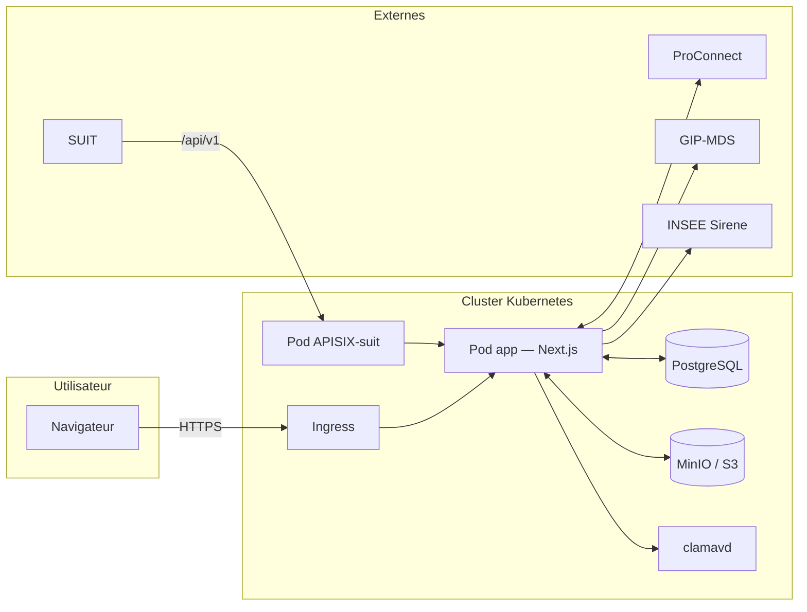
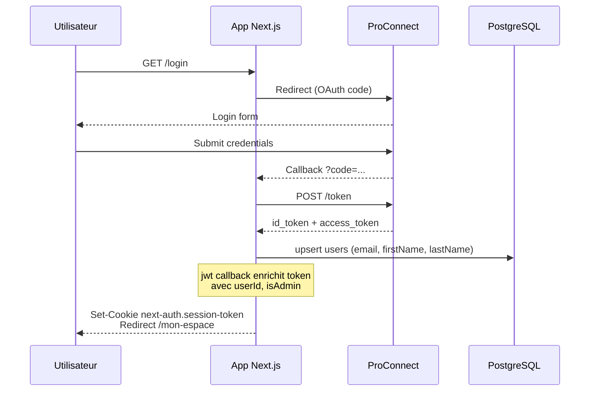
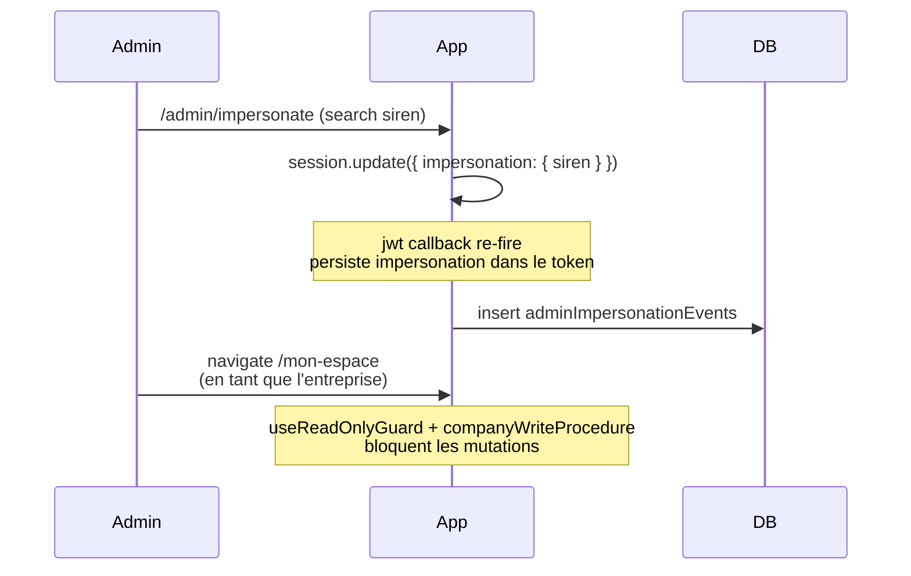
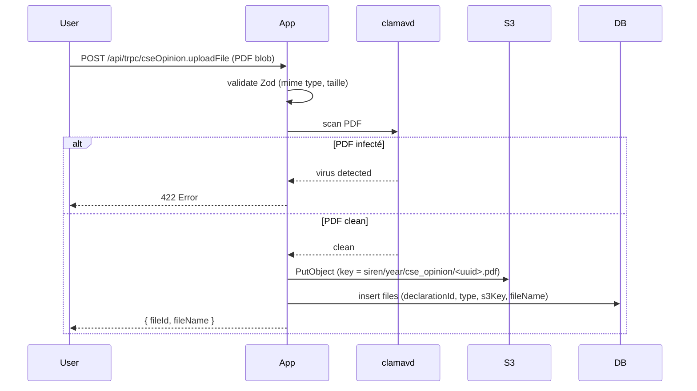
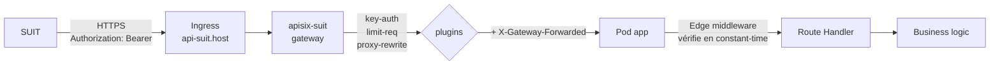

# Architecture EGAPRO V2

Vue d'ensemble des **mécanismes techniques** de la plateforme.

Audience principale : nouveaux développeurs (onboarding). L'équipe métier / PO peut utiliser ce document en survol pour situer les composants cités lors des arbitrages.

> Ce document complète [`docs/features.md`](features.md) (vue fonctionnelle) et [`docs/parcours-utilisateurs.md`](parcours-utilisateurs.md) (flux end-to-end). Pour les **conventions de code** détaillées, voir [`packages/app/CLAUDE.md`](../packages/app/CLAUDE.md).

## Sommaire

1. [Vue d'ensemble](#1-vue-densemble)
2. [Stack technique](#2-stack-technique)
3. [Structure du repo](#3-structure-du-repo)
4. [Couche domain](#4-couche-domain)
5. [Authentification, autorisation, impersonation](#5-authentification-autorisation-impersonation)
6. [API tRPC](#6-api-trpc)
7. [Base de données (Drizzle + PostgreSQL)](#7-base-de-données-drizzle--postgresql)
8. [Stockage de fichiers (S3-compatible)](#8-stockage-de-fichiers-s3-compatible)
9. [Audit logging](#9-audit-logging)
10. [Sécurité](#10-sécurité)
11. [UI, DSFR, accessibilité](#11-ui-dsfr-accessibilité)
12. [Observabilité (Sentry)](#12-observabilité-sentry)
13. [Tests](#13-tests)
14. [CI/CD et déploiement](#14-cicd-et-déploiement)
15. [Dépendances externes](#15-dépendances-externes)

---

## 1. Vue d'ensemble

EGAPRO V2 est une **application Next.js 16** (App Router, React 19) servant un site public et un espace authentifié, déployée dans un cluster Kubernetes via [Kontinuous](https://github.com/SocialGouv/kontinuous). Le code applicatif vit dans un **monorepo pnpm** (`packages/app/`) ; le package `packages/api/` est un placeholder vide hérité de la V1.



Trois grandes catégories de surface technique :

- **Pages publiques** (recherche, FAQ, mentions légales) : Server Components, lecture seule, pas d'authentification
- **Espace déclarant** (`/mon-espace`, `/declaration-remuneration/*`, `/avis-cse/*`) : authentifié via ProConnect, écritures protégées par tRPC
- **API privées** : tRPC interne (`/api/trpc/*`) pour le front, et REST-like (`/api/v1/*`, `/api/export/*`, `/api/pdf/*`) pour les intégrations externes

---

## 2. Stack technique

| Couche | Outil | Version | Rôle |
|---|---|---|---|
| Framework | Next.js (App Router) | ^16 | Serveur rendu, routing, RSC |
| UI | React | ^19 | Composants serveur + client |
| Langage | TypeScript | ^5 (strict) | Typage fort, `noUncheckedIndexedAccess` |
| Design system | DSFR | ^1.14 | Système officiel de l'État (sans `react-dsfr`) |
| Styling | SCSS Modules + DSFR | sass | Mixins DSFR auto-injectés |
| API interne | tRPC | ^11 | RPC typé bout-en-bout |
| ORM | Drizzle | ^0.45 | SQL typé, migrations versionnées |
| BDD | PostgreSQL | 14.17 | Local : Docker ; prod : managed |
| Auth | NextAuth | 4.x | Wrap ProConnect (OAuth/OIDC) |
| Validation | Zod | ^4 | Schemas partagés front + back |
| Lint / Format | Biome | ^2 | Remplace ESLint + Prettier |
| Tests unit | Vitest | ^4 | + coverage ≥ 75% global, 100% sur `domain/` |
| Tests E2E | Playwright | ^1.58 | Une E2E par `page.tsx` minimum |
| Observabilité | Sentry | — | Erreurs serveur + client |
| Mail | Nodemailer + maildev | — | Transactional, maildev en local |
| Stockage fichiers | MinIO local / S3 prod | — | Accessible via `@aws-sdk/client-s3` |
| Antivirus | ClamAV (`clamavd`) | — | Scan des PDF avant stockage |
| Cache (optionnel) | Valkey (Redis-compat) | — | Présent en docker-compose |
| Package manager | pnpm workspaces | ^10 | Workspace `packages/*` |

---

## 3. Structure du repo

```
egapro/
├── packages/
│   ├── app/                 # Application Next.js (tout le code actif)
│   │   ├── src/
│   │   │   ├── app/         # Routes Next.js (App Router) — wrappers fins
│   │   │   ├── modules/     # Logique métier + composants par domaine
│   │   │   ├── server/      # Code server-only (api, auth, db, audit, services)
│   │   │   ├── trpc/        # Client tRPC (react, server, query-client)
│   │   │   ├── env.js       # Variables d'env typées (@t3-oss/env-nextjs)
│   │   │   ├── middleware.ts        # Edge middleware (admin guard + APISIX defense)
│   │   │   ├── instrumentation.ts   # Sentry server + edge
│   │   │   └── instrumentation-client.ts  # Sentry client
│   │   ├── e2e/             # Tests Playwright
│   │   ├── public/dsfr/     # Assets DSFR copiés (git-ignored)
│   │   └── scripts/         # Scripts utilitaires (audit-cleanup.mjs, copy-dsfr.mjs)
│   └── api/                 # Placeholder vide (héritage V1)
├── .kontinuous/             # Manifests Kubernetes (Helm-like) pour dev/preprod/prod
├── .github/workflows/       # CI/CD GitHub Actions
├── docs/                    # Cette documentation
├── docker-compose.yml       # Stack locale (db, minio, clamavd, maildev, valkey)
└── CLAUDE.md                # Instructions globales (agents IA + devs)
```

### Modules (`src/modules/`)

Organisation **par domaine fonctionnel**, pas par type de fichier. Chaque module expose un `index.ts` (barrel) ; les consommateurs importent **uniquement** depuis le barrel.

```
modules/
  domain/         # Règles métier pures (cf. §4)
  layout/         # Header, Footer, SkipLinks
  home/           # Page d'accueil
  login/          # Page de connexion ProConnect
  auth/           # SessionProvider, useReadOnlyGuard, useIsImpersonating
  profile/        # Profil utilisateur (téléphone)
  my-space/       # /mon-espace
  declaration-remuneration/  # Wizard déclaration index
  cseOpinion/     # Avis CSE (formulaires + upload PDF)
  declarationPdf/ # Génération PDF récap & reçu
  noSanctionAttestation/  # Attestation no-sanction PDF
  export/         # Exports XLSX + API publique
  admin/          # Espace administrateur DGT
  referents/      # Annuaire référents (public)
  aide/           # Pages d'aide + contact
  faq/            # FAQ statique
  legal/          # Pages légales
  audit/          # Constantes & types audit
  mail/           # Mails transactionnels
  analytics/      # Matomo
  shared/         # Hooks partagés (useZodForm, useFileUploadForm, …)
```

Règle d'or : **pas de composant custom dans `src/app/`**. Les fichiers `page.tsx` sont des wrappers fins qui importent depuis un module. Cette règle est **bloquée par le hook `block-bad-patterns`** (rejet de l'edit).

### Server (`src/server/`)

```
server/
  api/
    routers/      # Procédures tRPC, une par domaine (declaration, admin, cseOpinion, …)
    trpc.ts       # Builder + procédures (publicProcedure, protectedProcedure, …)
    root.ts       # Composition : appRouter
  auth/           # Configuration NextAuth (ProConnect provider + callbacks)
  audit/          # Middleware tRPC + withAuditedRoute + cachedAuth + logAction
  db/             # Schéma Drizzle + connexion PostgreSQL
  services/       # Intégrations tierces (gipMds, …)
```

---

## 4. Couche domain

`src/modules/domain/` concentre toutes les **règles métier pures** : isomorphes (utilisables côté serveur ET client), aucune dépendance React / tRPC / Drizzle.

```
domain/
  index.ts        # Barrel — point d'import unique
  types.ts        # GapLevel, DeclarationStatus, …
  shared/
    constants.ts          # GAP_ALERT_THRESHOLD, MAX_CSE_FILES, COMPANY_SIZE_*
    gap.ts                # computeGap, gapLevel, formatGap
    siren.ts              # extractSiren, formatSiren, validateSiren
    campaign.ts           # getCurrentYear, getCseYear (règles temporelles)
    declarationStatus.ts  # State machine de statut
    companySize.ts        # isCseRequired, COMPANY_SIZE_RANGES
  __tests__/      # 100% coverage sur toutes les fonctions
```

**Pourquoi cette discipline** :

- Les règles changent peu souvent mais sont **critiques** (un bug ici impacte 100% des déclarations).
- Centraliser permet de **tester exhaustivement** sans monter une page.
- Les contraintes du règlement (seuils, calendriers) sont **lisibles à un endroit unique**, ce qui simplifie l'audit métier.

Hooks de garde :

- `block-bad-patterns` rejette `new Date().getFullYear()` en dehors de `domain/` → forcer `getCurrentYear()`.
- Idem pour `siret.slice(0, 9)` → forcer `extractSiren(siret)`.
- Idem pour les seuils 5 / 50 / 100 hardcodés → forcer les constantes nommées.

Toujours importer depuis le barrel :

```ts
import { getCurrentYear, GAP_ALERT_THRESHOLD, isCseRequired } from "~/modules/domain";
```

---

## 5. Authentification, autorisation, impersonation

### 5.1 ProConnect (OAuth / OIDC)

Auth déléguée à **[ProConnect](https://proconnect.gouv.fr)**, le SSO de l'État. Configuration dans `src/server/auth/`. NextAuth 4.x stocke la session dans un **JWT cookie** (pas de table `sessions` côté DB).

En **local**, le fournisseur de test est **FIA1V2** (compte `test@fia1.fr` sans mot de passe).

### 5.2 Cycle de vie de la session



### 5.3 JWT enrichissement

Le callback `jwt` (NextAuth) :

1. À la connexion : upsert dans `users` (email, prénom, nom), récupère `id` et `isAdmin`.
2. Injecte `userId`, `email`, `isAdmin` dans le token.
3. Si l'utilisateur est admin et qu'une **impersonation** est active (via `session.update({ siren })`), injecte `impersonation: { siren, startedAt }`.

### 5.4 Edge middleware (`src/middleware.ts`)

Deux responsabilités, deux scopes URL :

| Scope | Garde | Comportement si KO |
|---|---|---|
| `/admin/*` | Décode le JWT, exige `isAdmin === true` | Redirect `/login?callbackUrl=...` si pas de token, ou `/mon-espace` si token sans isAdmin |
| `/api/v1/*` | Vérifie le header `X-Gateway-Forwarded` (constant-time) | 403 si présent mais invalide |

**Defense in depth** : `src/app/admin/layout.tsx` re-vérifie la session côté Node runtime pour les tokens dépourvus du flag `isAdmin` (fallback de migration).

### 5.5 Impersonation admin

L'admin DGT peut **incarner** une entreprise pour la dépanner. Le flux :



L'écriture est bloquée à **deux niveaux** : front (`useReadOnlyGuard`) et back (`companyWriteProcedure` rejette si impersonation). Tracé dans `adminImpersonationEvents` + audit log.

---

## 6. API tRPC

Une procédure tRPC = un appel typé bout-en-bout (input Zod, output inféré). Le client React utilise `@trpc/react-query` pour bénéficier de SWR / cache.

### 6.1 Procédures de base

| Builder | Middleware appliqués | Audience |
|---|---|---|
| `publicProcedure` | rien | Public (non authentifié) |
| `protectedProcedure` | session valide | Utilisateur connecté |
| `companyProcedure` | session + binding SIREN (depuis le contexte) | Utilisateur agissant pour une entreprise |
| `companyWriteProcedure` | + read-only guard (refus si impersonation) | Utilisateur, écriture |
| `declarationProcedure` | `companyProcedure` + résolution déclaration | Utilisateur, lecture déclaration |
| `declarationWriteProcedure` | + read-only guard | Utilisateur, écriture déclaration |
| `adminProcedure` | session + `isAdmin === true` | Admin DGT |

Définies dans `src/server/api/trpc.ts`. Les routers (un par domaine) composent ces builders selon le besoin.

### 6.2 Schémas Zod partagés

Les schémas Zod sont la **single source of truth** : utilisés à la fois par le formulaire React (`useZodForm`) et par la procédure tRPC (`.input(schema)`). Ils vivent dans `src/modules/{domain}/schemas.ts`, **jamais inline dans `src/server/api/routers/`** (règle bloquée par hook).

### 6.3 Audit middleware

Un middleware tRPC global lit la map `PROCEDURE_TO_ACTION` (dans `src/server/audit/trpcMiddleware.ts`). Si la procédure courante y figure, un appel à `logAction(...)` est ajouté **après** l'exécution (succès ou échec). Voir §9.

---

## 7. Base de données (Drizzle + PostgreSQL)

### 7.1 Schéma

Définition dans `src/server/db/`. Tables principales :

| Table | Rôle |
|---|---|
| `users` | Utilisateurs (email ProConnect, firstName, lastName, isAdmin) |
| `userCompanies` | N-N user × siren (rattachement) |
| `companies` | Entreprises (siren, name, nafCode, workforce, hasCse) |
| `declarations` | Déclarations index (id, siren, year, status, currentStep, …) |
| `jobCategories` | Catégories d'emploi (déclaration, optionnel) |
| `employeeCategories` | Indicateur G (par catégorie) |
| `cseOpinions` | Avis CSE (deux types : exactitude + écarts) |
| `files` | PDF stockés sur S3 (cse_opinion, joint_evaluation) |
| `referents` | Annuaire référents régionaux |
| `campaignDeadlines` | Deadlines par année (configuration admin) |
| `gipMdsData` | Pré-remplissage GIP-MDS (par siren + year) |
| `adminImpersonationEvents` | Trace des impersonations admin |
| `audit.action_log` | Log d'audit (schéma Postgres dédié `audit`) |

### 7.2 Convention de casing

Toutes les propriétés de schéma sont **camelCase** côté TypeScript, automatiquement mappées en **snake_case** côté SQL via `casing: "snake_case"` (configuré dans `src/server/db/index.ts` et `drizzle.config.ts`). Ne **jamais** spécifier de nom de colonne explicite (`pgTable('foo', { firstName: text() })` → colonne `first_name`).

### 7.3 Migrations (Drizzle Kit)

```bash
pnpm db:generate   # génère un fichier SQL après modif schéma
pnpm db:migrate    # applique les migrations en attente
pnpm db:push       # applique le schéma directement (dev only, sans migration)
pnpm db:studio     # UI Drizzle Studio (inspection)
```

Les migrations sont **versionnées dans le repo** (`packages/app/drizzle/`). En CI/CD, le job `migrate` (docker-compose en local, container Kubernetes en cluster) applique les migrations en attente avant de démarrer l'app.

### 7.4 Transactions

Toute opération qui touche **plusieurs tables** doit utiliser `db.transaction(...)`. Règle enforcée par `structural-auditor` et `security-auditor`.

---

## 8. Stockage de fichiers (S3-compatible)

Les PDF (avis CSE, évaluation conjointe) sont stockés sur **MinIO** en local (service docker-compose `minio`) et sur **S3** en cluster. L'accès se fait via `@aws-sdk/client-s3`.

### 8.1 Flux upload



### 8.2 Antivirus ClamAV

Le service `clamavd` scanne les uploads via le protocole ClamAV (TCP). Si le scanner refuse, le fichier est **rejeté avant** stockage S3 (jamais persisté).

### 8.3 Téléchargement

Les fichiers sont servis via une Route Handler `/api/v1/files/:fileId` qui fait du **streaming** depuis S3 (pas de signed URL exposée publiquement). Auth duale : header APISIX (côté SUIT) ou session NextAuth (côté front).

---

## 9. Audit logging

Module : `src/modules/audit/` (constantes, types) + `src/server/audit/` (runtime). Documentation détaillée : [`.claude/rules/audit-logging.md`](../.claude/rules/audit-logging.md).

### 9.1 Pourquoi

Conformité **CNIL / DGT** : tracer toutes les actions de mutation et toutes les lectures de données sensibles (PII, données entreprise, PDF), avec rétention bornée.

### 9.2 Schéma `audit.action_log`

```
id, user_id, user_email, siren, action, status,
ip_address, user_agent, metadata (jsonb), created_at
```

Le `metadata` jsonb est **automatiquement sanitizé** : les clés `password`, `token`, `refresh_token`, `secret`, `client_secret`, `authorization`, `apikey`, `api_key`, `accesskey`, `access_key`, `private_key` sont strippées récursivement (peu importe la profondeur).

### 9.3 Catégories et rétention

Définies dans `src/modules/audit/shared/constants.ts` :

| Catégorie | Rétention | Exemples |
|---|---|---|
| `mutation` | 365 j | Toutes les écritures (déclaration, CSE, admin) |
| `read_sensitive` | 180 j | `profile.get`, `declaration.getOrCreate`, recherche admin, téléchargement PDF |
| `public_search` | 180 j | Recherche / vue de référents publics |
| `auth` | 365 j | Login OK / KO, logout |
| `export` | 365 j | API publique d'export |
| `system` | 365 j | Import GIP, cron de cleanup |

`AUDIT_RETENTION_DAYS_SHORT = 180`, `AUDIT_RETENTION_DAYS_LONG = 365`. Modifiables via env var (`EGAPRO_AUDIT_RETENTION_*_DAYS`).

### 9.4 Wire-up obligatoire

Toute nouvelle action audited requiert **3 points** :

1. Constante dans `actionKeys.ts` (`AUDIT_ACTIONS.NEW_THING`)
2. Catégorie dans `AUDIT_ACTION_CATEGORIES` (drives la rétention)
3. Surface :
   - Pour une procédure tRPC → entrée dans `PROCEDURE_TO_ACTION` (middleware auto)
   - Pour une Route Handler → wrapper `withAuditedRoute({ action, resolveContext }, handler)`
   - Pour un événement auth ou un cron → appel direct à `logAction(...)`

### 9.5 Cron de cleanup

`packages/app/scripts/audit-cleanup.mjs` tourne quotidiennement (CronJob Kubernetes) et purge les lignes au-delà de leur fenêtre de rétention (segmentée par catégorie). Modifications de ce script → **test d'intégration obligatoire** (`*.integration.test.ts`, `pnpm test:integration`, requiert Docker) pour attraper les bugs driver.

---

## 10. Sécurité

### 10.1 Sécurisation `/api/v1/*` (intégration SUIT)

L'API privée consommée par **SUIT** (Système Unifié d'Inspection du Travail) est protégée par une **passerelle APISIX standalone**, déployée en amont de l'app dans le même cluster :



**Plugins APISIX actifs** :

- `key-auth` — valide le Bearer (`EGAPRO_SUIT_API_KEY`)
- `limit-req` — rate limit ~10 req/s, burst 5
- `proxy-rewrite` — injecte `X-Gateway-Forwarded: <EGAPRO_GATEWAY_SHARED_SECRET>`

**Defense in depth** côté app : le middleware Edge vérifie la présence et la valeur du header en **constant-time**. Un pod compromis dans le cluster ne peut donc pas appeler `/api/v1/*` directement (sans passer par la gateway).

Côté client SUIT : un seul header `Authorization: Bearer <clé>`. Plus de signature RSA + timestamp comme en V1 (cf. [docs/SUIT-API.md](SUIT-API.md)).

### 10.2 Validation Zod aux frontières

Toute entrée externe est validée via **Zod** :

- Formulaires (`useZodForm` + `zodResolver`)
- Procédures tRPC (`.input(schema)`)
- Route Handlers (parse explicite du body / query)
- Variables d'environnement (`@t3-oss/env-nextjs` dans `src/env.js`)

### 10.3 Variables d'environnement

Déclarées et validées dans `src/env.js` (server / client / runtimeEnv). **Jamais lire `process.env` directement** (bloqué par hook). Pour ajouter une variable :

1. Déclarer dans `src/env.js`
2. Ajouter à `runtimeEnv`
3. Ajouter à `.env` local
4. Ajouter à la config de déploiement (`.kontinuous/templates/egapro.configmap.yaml` pour les valeurs publiques, sealed-secret pour les secrets)

Bypass de la validation : `SKIP_ENV_VALIDATION=1` (Docker build, CI sans secrets).

### 10.4 Secrets

Aucune valeur secrète **dans le repo**. Les secrets cluster sont gérés via des [sealed-secrets](https://github.com/bitnami-labs/sealed-secrets) sous `.kontinuous/`. Les rotations clés (clé API SUIT, shared secret APISIX↔app, secret NextAuth) sont documentées dans le [README racine](../README.md#rotation-des-secrets).

---

## 11. UI, DSFR, accessibilité

### 11.1 DSFR sans `react-dsfr`

Le **Système de Design de l'État** est utilisé en mode "natif" : on importe le CSS et le JS DSFR directement, sans wrapper React (`react-dsfr` n'est pas utilisé). Concrètement :

- **Assets** : copiés dans `public/dsfr/` par `scripts/copy-dsfr.mjs` (git-ignored, regénéré sur `dev` / `build`).
- **CSS** : chargé via `<link>` dans `src/app/layout.tsx`.
- **JS** : chargé via `<Script type="module" strategy="beforeInteractive">`. Gère modales, dropdowns, theme toggle, navigation clavier. **Ne jamais dupliquer** ce comportement en React — utiliser les attributs `data-fr-*`.

### 11.2 Composants

Discipline RSC stricte : **Server Component par défaut**. `"use client"` uniquement pour les hooks, événements navigateur ou Web APIs. Isoler la partie interactive au niveau le plus bas possible.

### 11.3 Styling cascade

Priorité stricte : 1) classes DSFR → 2) utilities DSFR + CSS variables → 3) SCSS Module scopé (dernier recours).

`style={}` inline est **bloqué par hook**. Les `@media (width|screen)` en SCSS aussi (forcer `@include respond-from(md)`).

### 11.4 Dark mode

Activé via `data-fr-scheme="system"` sur `<html>`. Cookie `fr-theme` lu par un script inline en tête (évite le flash). Modale `ThemeModal` pour le choix utilisateur (light / dark / system).

### 11.5 RGAA / WCAG 2.1 AA

Score Lighthouse accessibilité **= 100%** (seuil bloquant CI dans `.lighthouserc.json`). Audit quotidien automatisé : workflow `rgaa-audit.yaml` (cron 06:00 UTC tous les jours ouvrés).

Checklist obligatoire (extrait, voir [`packages/app/CLAUDE.md`](../packages/app/CLAUDE.md#accessibility-rgaa--wcag-21-aa) pour le complet) :

- `SkipLinks` en premier enfant de `<body>` (RGAA 12.7)
- Landmarks sémantiques (`<header>`, `<nav>`, `<main>`, `<footer>`) sans `role` redondant
- Modales : `role="dialog"` + `aria-modal="true"` + `aria-labelledby`
- `target="_blank"` toujours accompagné de `<NewTabNotice />`
- `<NavLink>` pour `aria-current="page"` calculé via `usePathname()`
- Icônes décoratives : `aria-hidden="true"`
- Images : toujours `next/image` (raw `` bloqué par hook)

---

## 12. Observabilité (Sentry)

Trois entrées Sentry, une par runtime :

| Fichier | Runtime | Rôle |
|---|---|---|
| `src/instrumentation.ts` | Server (Node) | Erreurs SSR, Server Components, tRPC |
| `src/sentry.edge.config.ts` | Edge | Middleware `src/middleware.ts` |
| `src/instrumentation-client.ts` | Client (browser) | Erreurs React + global handlers |

`src/app/global-error.tsx` capture les erreurs non gérées de l'arbre React et les remonte à Sentry avant de rendre la page d'erreur.

DSN configurés via env (`NEXT_PUBLIC_SENTRY_DSN` côté client, `SENTRY_DSN` côté serveur).

Pas de dashboard Grafana ou de monitoring custom dédié à l'app — l'observabilité repose sur Sentry + les healthchecks Kubernetes.

---

## 13. Tests

| Type | Outil | Localisation | Couverture cible |
|---|---|---|---|
| Unit | Vitest | `src/modules/**/__tests__/` | ≥ 75% global, **100%** sur `domain/` |
| E2E | Playwright | `packages/app/src/e2e/` | Au moins une E2E par `page.tsx` |
| A11y | Lighthouse CI | `.lighthouserc.json` | **100%** accessibilité (bloquant) |
| RGAA quotidien | Workflow GitHub Actions | `.github/workflows/rgaa-audit.yaml` | Cron 06:00 UTC jours ouvrés |
| Intégration BDD | Vitest + Docker | `*.integration.test.ts` | Obligatoire pour code touchant `audit.action_log` |

### 13.1 Mocks centralisés

Les mocks standards (`next/link`, `next/navigation`, `next/image`, `next-auth/react`, `server-only`, `~/trpc/server`) sont définis **une seule fois** dans `src/test/setup.ts` et auto-chargés par Vitest. Ne **jamais** les dupliquer dans les fichiers de test.

### 13.2 Lancer les tests

```bash
pnpm test              # Vitest (watch mode interactif)
pnpm test:e2e          # Playwright (nécessite pnpm dev sur :3000)
pnpm test:lighthouse   # Lighthouse CI (nécessite pnpm dev sur :3000)
pnpm test:integration  # Tests intégration BDD (nécessite Docker)
```

---

## 14. CI/CD et déploiement

### 14.1 Workflows GitHub Actions

| Workflow | Trigger | Rôle |
|---|---|---|
| `ci.yaml` | push | Build + lint + format + typecheck + tests |
| `e2e.yaml` | push | Tests E2E Playwright |
| `lighthouse.yaml` | `deployment_status` | Audit Lighthouse sur l'env de review |
| `db-schema.yaml` | push (master, alpha) | Génération doc schéma BDD |
| `review-auto.yaml` / `review.yaml` | push branches | Déploiement environnement de review (par PR) |
| `deactivate.yaml` | PR closed / branch deleted | Cleanup environnement de review |
| `preproduction.yaml` | push branche `beta` | Déploiement preprod |
| `production.yaml` | push tag | Déploiement prod |
| `release.yml` | manuel | semantic-release (versionnement automatique) |
| `rgaa-audit.yaml` | cron 06:00 UTC L–V | Audit RGAA quotidien |
| `claude-question.yml` / `claude-revue-rgaa.yml` | issue/PR labels | Intégrations IA (questions ; revue RGAA) |

### 14.2 Kontinuous (déploiement Kubernetes)

[Kontinuous](https://github.com/SocialGouv/kontinuous) est l'outil interne SocialGouv qui templatise les manifests Kubernetes. Structure dans `.kontinuous/` :

```
.kontinuous/
  Chart.yaml          # Sub-charts (app, postgres, apisix-suit, …)
  config.yaml         # Config par défaut
  values.yaml         # Valeurs par défaut
  templates/          # Manifests (Deployment, Service, ConfigMap, sealed-secrets, …)
  env/
    dev/              # Surcharges dev
    preprod/          # Surcharges preprod
    prod/             # Surcharges prod
```

Trois environnements gérés : **dev** (review apps), **preprod** (branche `beta`), **prod** (tags Git).

### 14.3 Stack locale

`docker-compose.yml` à la racine lance les services nécessaires au dev :

| Service | Image | Rôle |
|---|---|---|
| `db` | `postgres:14.17` | Base de données principale |
| `migrate` | `node:22-slim` | Applique les migrations Drizzle au démarrage |
| `minio` | `minio/minio` | Stockage S3-compatible |
| `maildev` | — | Capteur de mails dev (web UI sur :1080) |
| `clamavd` | — | Antivirus pour l'upload de PDF |
| `valkey` | — | Cache Redis-compatible (optionnel) |

```bash
docker compose up -d   # démarre tout
pnpm dev:app           # lance Next.js sur :3000
```

---

## 15. Dépendances externes

| Système | Rôle | Critique ? |
|---|---|---|
| **ProConnect** | SSO d'État (auth utilisateurs) | Oui (pas de fallback en prod) |
| **GIP-MDS** | Calcul des indicateurs A–F (CSV importé chaque mars) | Non (déclaration possible sans pré-remplissage) |
| **INSEE Sirene** | Identification des entreprises (raison sociale, NAF, effectif) | Lecture (cache) |
| **SUIT / Delphes** | Inspection du travail (consomme `/api/v1/*`) | Non (intégration sortante) |
| **D@ccords** | Dépôt des accords collectifs | Non (lien externe) |
| **AWS S3** (ou MinIO) | Stockage des PDF | Oui pour l'upload CSE |
| **Mailer SMTP** (prod) | Envoi des reçus de déclaration | Important (pas bloquant si défaillant) |

Les pannes de ProConnect bloquent **complètement** la connexion ; aucune procédure de secours côté app.

---

## Pour aller plus loin

- **Conventions de code** détaillées : [`packages/app/CLAUDE.md`](../packages/app/CLAUDE.md)
- **Règles de qualité** automatisées : [`.claude/rules/`](../.claude/rules/) (audit logging, code-quality, database-drizzle, react-components, styling-dsfr, testing, trpc-api, …)
- **Wiki Spec V2** (réglementation) : <https://github.com/SocialGouv/egapro/wiki/Spec-V2>
- **Features** (vue fonctionnelle) : [`docs/features.md`](features.md)
- **Parcours utilisateurs** : [`docs/parcours-utilisateurs.md`](parcours-utilisateurs.md)
