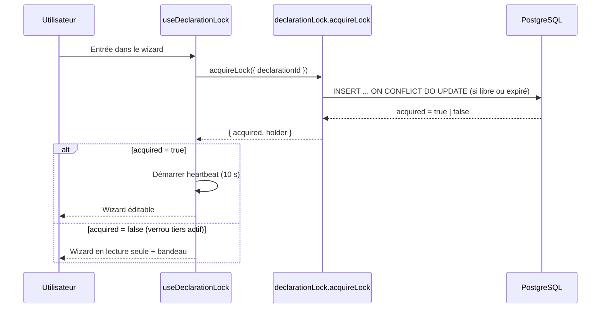

# Features EGAPRO V2

Vue d'ensemble synthétique des fonctionnalités de la plateforme EGAPRO V2.

Audience : nouveaux développeurs (onboarding) et équipe métier / PO (référence rapide).

> Pour les règles juridiques de fond (loi, décrets, calendriers d'entrée en vigueur), voir le [README racine](../README.md) et le [wiki Spec V2](https://github.com/SocialGouv/egapro/wiki/Spec-V2). Ce document décrit ce que **fait l'application**, pas ce que **prescrit la loi**.

## Sommaire

1. [Authentification & gestion du compte](#1-authentification--gestion-du-compte)
2. [Déclaration de l'index égalité](#2-déclaration-de-lindex-égalité)
3. [Historique des modifications d'une démarche](#3-historique-des-modifications-dune-démarche)
4. [Avis du CSE](#4-avis-du-cse)
5. [Parcours de conformité (seconde déclaration)](#5-parcours-de-conformité-seconde-déclaration)
6. [Recherche et consultation publique](#6-recherche-et-consultation-publique)
7. [Référents régionaux](#7-référents-régionaux)
8. [Aide, FAQ, contact](#8-aide-faq-contact)
9. [Pages légales et sitemap](#9-pages-légales-et-sitemap)
10. [PDF et exports](#10-pdf-et-exports)
11. [Espace administrateur (DGT)](#11-espace-administrateur-dgt)
12. [Mécanismes transverses](#12-mécanismes-transverses)
13. [Annexe : tables Drizzle principales](#13-annexe--tables-drizzle-principales)

Conventions de notation :

- **Route** : chemin URL exposé par Next.js (`src/app/...`)
- **Module** : feature module (`src/modules/<nom>/`)
- **Router tRPC** : procédures back exposées (`src/server/api/routers/<nom>.ts`)
- Les chemins commençant par `~/` correspondent à `packages/app/src/`

---

## 1. Authentification & gestion du compte

**Pour qui** : tout employeur déclarant qui se connecte à la plateforme.

**À quoi ça sert** : créer une session utilisateur via **ProConnect** (le SSO de l'État), retrouver les entreprises rattachées au compte, compléter son profil (téléphone obligatoire au premier accès).

**Routes** :

- `/login` — page d'entrée, redirige vers ProConnect ou vers `/mon-espace` si déjà connecté
- `/mon-espace` — espace personnel, liste les entreprises de l'utilisateur
- `/mon-espace/mes-entreprises` — détail des entreprises, statut de leurs déclarations

**Modules** : `~/modules/login`, `~/modules/auth`, `~/modules/profile`, `~/modules/my-space`.

**Router tRPC** :

- `profile.get` — lecture du profil (audit `read_sensitive`)
- `profile.updatePhone` — mise à jour du téléphone (modal au premier accès)
- `company.get` / `company.list` — détails et liste des entreprises rattachées (avec statut CSE et déclarations)

**Règles métier-clés** :

- L'authentification utilise **NextAuth + ProConnect**. Le callback JWT injecte le contexte d'impersonation admin si présent (voir §11).
- Le **téléphone est requis** : si la table `profile` n'a pas de ligne pour l'utilisateur, une modale s'ouvre automatiquement à l'accès `/mon-espace`.
- Les entreprises sont rattachées via la table `userCompanies` (relation N-N entre `users` et `companies`).
- En environnement local, le fournisseur de test ProConnect est **FIA1V2** (compte `test@fia1.fr`).
- À la **déconnexion**, tous les verrous de modification détenus par l'utilisateur sont libérés (voir §12.7).

---

## 2. Déclaration de l'index égalité

**Pour qui** : employeur déclarant pour son entreprise (≥ 50 salariés en règle générale, volontaire pour < 50).

**À quoi ça sert** : déclarer chaque année les **7 indicateurs** d'égalité femmes-hommes (A à G). Les indicateurs A–F sont **pré-calculés par le GIP-MDS** à partir des DSN ; l'indicateur G (écart par catégorie d'emploi, optionnel) est **saisi par l'entreprise**.

**Route principale** : `/declaration-remuneration/`, organisé en wizard multi-étapes.

| Étape | URL | Contenu |
|---|---|---|
| 1 | `/declaration-remuneration/etape/1` | Effectifs (femmes / hommes) |
| 2 | `/declaration-remuneration/etape/2` | Indicateurs A et C — écart de rémunération annuel et horaire |
| 3 | `/declaration-remuneration/etape/3` | Indicateurs B, D, E — écart sur la rémunération variable + promotions |
| 4 | `/declaration-remuneration/etape/4` | Quartiles (4 × 2 : annuel + horaire) — répartition des effectifs par tranche de salaire |
| 5 | `/declaration-remuneration/etape/5` | Catégories de salariés (indicateur G, optionnel) |
| 6 | `/declaration-remuneration/etape/6` | Récapitulatif et soumission |
| — | `/declaration-remuneration/recapitulatif/` | Vue lecture seule de la déclaration soumise |

**Modules** : `~/modules/declaration-remuneration` (wizard, steps, recap), `~/modules/domain` (calculs et règles).

**Router tRPC** : `~/server/api/routers/declaration.ts`. Procédures principales :

- `declaration.getOrCreate` — création paresseuse du brouillon (seulement si l'utilisateur est propriétaire ; en mode admin impersonation, un placeholder transient est renvoyé sans écriture)
- `declaration.updateStep1` … `updateStep4` — sauvegarde par étape (audit `mutation`, une action par étape) — protégées par `declarationLockedWriteProcedure` (voir §12.7)
- `declaration.updateEmployeeCategories` — sauvegarde de l'indicateur G
- `declaration.submit` — bascule `status = submitted`, fixe le snapshot `cseRequired` et envoie le reçu (voir §12.1)

**Règles métier-clés** :

- L'**année de campagne** = année calendaire suivant l'année des données : `getCurrentYear()` retourne 2025 quand les données sont celles de 2024 (voir `~/modules/domain`).
- Le **calcul des écarts** est centralisé dans `computeGap(womenPay, menPay)` (positif si les hommes gagnent plus, négatif sinon).
- **Seuil d'alerte** : `GAP_ALERT_THRESHOLD = 5%`. Au-delà, une **seconde déclaration** est obligatoire pour les entreprises ≥ 100 salariés (voir §5).
- L'**indicateur G** est optionnel ; quand il est renseigné, l'entreprise définit ses propres catégories d'emploi (par accord ou décision unilatérale).
- Une fois `submitted`, la déclaration peut être modifiée jusqu'à la **deadline `decl1ModificationDeadline`** (configurée par l'admin DGT, voir §11) ; après, elle bascule en lecture seule.
- En **admin impersonation**, l'écriture est bloquée (procédures `companyWriteProcedure` rejettent ; voir `~/modules/auth/useReadOnlyGuard`).
- **Verrou collaboratif** : à l'entrée dans le wizard, le hook `useDeclarationLock` acquiert un verrou exclusif. Si une autre session détient déjà un verrou actif, le wizard s'ouvre en lecture seule avec un bandeau d'avertissement (voir §12.7).
- Chaque transition métier de la démarche (changement d'étape, soumission, choix de parcours, etc.) écrit une ligne dans `declarationStatusHistory`, exploitée par la page d'historique (voir §3).
- **Conservation limitée** : les déclarations dont l'année dépasse la fenêtre de rétention (défaut 6 ans) sont purgées automatiquement, avec toutes leurs données rattachées (voir §12.8).

**Données persistées** : `declarations`, `jobCategories`, `employeeCategories`, `declarationStatusHistory`, `declarationLocks` (verrou d'édition temporaire).

---

## 3. Historique des modifications d'une démarche

**Pour qui** : employeur déclarant rattaché à l'entreprise (ou agent admin en impersonation sur le SIREN concerné).

**À quoi ça sert** : consulter la **chronologie des actions** effectuées sur la démarche d'une année donnée — qui a fait quoi, quand, et sur quelle page. Donne une traçabilité complète : changements d'étape, soumission, choix de parcours de conformité, seconde déclaration, évaluation conjointe, dépôt d'avis CSE, annulation, finalisation.

**Route** : `/mon-espace/historique/[siren]/[year]`

L'accès se fait depuis le panneau latéral de l'espace personnel via le lien **« Voir l'historique »** (`~/modules/my-space/DeclarationProcessPanel.tsx`), qui pointe vers `/mon-espace/historique/<siren>/<year>`.

**Module** : `~/modules/declarationHistory` (page, liste paginée, entrée, mapping événement → libellé). La fonction pure de mapping `getHistoryEventDisplay` traduit chaque type d'événement (`eventType`) en libellé FR, libellé de page et lien associé.

**Router tRPC** :

- `declaration.getStatusHistory` — lecture paginée de l'historique (`protectedProcedure`, audit `read_sensitive`, action `declaration_history.read`)

**Règles métier-clés** :

- L'accès est **gardé** : la procédure vérifie que l'utilisateur est rattaché à l'entreprise via `userCompanies` (sauf en impersonation admin sur ce SIREN). Sinon `FORBIDDEN`.
- La page Next.js valide les paramètres : `siren` de 9 caractères et `year ≥ 2018` (sinon `notFound()`), session requise (sinon redirection `/login`).
- Les lignes proviennent de `declarationStatusHistory` jointes à `users` pour récupérer l'**auteur** (prénom, nom, email). Si aucun auteur (action système), le libellé affiché est « Système ».
- Tri **du plus récent au plus ancien** (`order by createdAt desc`).
- **Pagination** : `limit` (défaut 10, max 50) + `offset`. La query renvoie `{ items, total }` ; l'UI cumule les pages via un bouton **« Voir plus »** tant que `items.length < total`.
- Chaque entrée affiche la **date et l'heure** (formatées en `fr-FR`), l'auteur (nom + email) et, le cas échéant, un lien **« Page : … »** vers l'écran concerné par l'action (récapitulatif, parcours de conformité, évaluation conjointe, avis CSE, étape du wizard…).
- État vide : « Aucune action enregistrée pour cette démarche. »

**Types d'événements mappés** (`getHistoryEventDisplay`) :

| Événement (`eventType`) | Libellé affiché | Page liée |
|---|---|---|
| `step_change` | Modification de la page | Étape du wizard correspondante (si connue) |
| `submit` | Soumission de la déclaration | Récapitulatif de votre déclaration |
| `path_choice` | Choix du parcours de mise en conformité | Parcours de mise en conformité |
| `second_declaration_submit` | Soumission de la seconde déclaration | Parcours de mise en conformité |
| `joint_evaluation_submit` | Dépôt de l'évaluation conjointe | Évaluation conjointe |
| `cse_opinion_submit` | Dépôt de l'avis CSE | Avis CSE |
| `cancel` | Annulation de la déclaration | — |
| `demarche_complete` | Démarche finalisée | — |

**Données persistées** : `declarationStatusHistory` (lecture seule pour cette feature ; les lignes sont écrites par les mutations de §2, §4 et §5).

---

## 4. Avis du CSE

**Pour qui** : entreprises **≥ 100 salariés** (l'avis CSE est obligatoire à partir de ce seuil ; il est interdit en dessous).

**À quoi ça sert** : recueillir l'**avis formel du Comité Social et Économique** sur la déclaration et sur les écarts constatés, avec dépôt du ou des PV au format PDF, et association de chaque fichier à son type de contenu.

**Routes** :

- `/avis-cse/etape/1` — saisie des avis (favorable / défavorable + dates)
- `/avis-cse/etape/2` — upload des PDF + association fichier ↔ type de contenu
- `/avis-cse/confirmation` — confirmation après finalisation

**Modules** : `~/modules/cseOpinion`.

**Router tRPC** : `~/server/api/routers/cseOpinion.ts`. Procédures :

| Procédure | Type | Rôle |
|---|---|---|
| `cseOpinion.get` | query | Lecture des avis enregistrés |
| `cseOpinion.saveOpinions` | mutation | Sauvegarde du formulaire étape 1 (delete + insert) |
| `cseOpinion.uploadFile` | mutation | Upload d'un PDF vers S3 (scan ClamAV inclus) |
| `cseOpinion.deleteFile` | mutation | Suppression d'un PDF (S3 + BDD) |
| `cseOpinion.getFiles` | query | Liste des PDF uploadés |
| `cseOpinion.getFileContentTypes` | query | Lecture des associations fichier ↔ type de contenu |
| `cseOpinion.setFileContentTypes` | mutation | Enregistre (replace-all) les associations fichier ↔ type de contenu |
| `cseOpinion.finalize` | mutation | Clôt l'avis (`cseStatus = submitted`) après validation des pré-conditions |

**Upload de PDF** : l'upload ne passe **pas** par tRPC mais par la Route Handler `POST /api/upload` avec l'en-tête `X-Flow-Type: cse_opinion` (voir §12.6). À la fin d'un upload réussi, la route envoie automatiquement le mail de confirmation CSE via `enqueueReceipt({ kind: "cseOpinion" })` (voir §12.1).

**Règles métier-clés** :

- Disponible **uniquement si `isCseRequired(workforce)` est vrai** (≥ 100 salariés, voir `~/modules/domain/shared/companySize.ts`).
- Deux types d'avis par déclaration :
  - **Avis sur l'exactitude** (`type = "accuracy"`) des données (favorable / défavorable, date)
  - **Avis sur les écarts** (`type = "gap"`) — peut être marqué `gapConsulted = false` si non requis
- Le formulaire couvre la **première et la seconde déclaration** (champ `declarationNumber: 1 | 2`).
- **Limite** : `MAX_CSE_FILES = 4` PDF par année.
- Après upload, chaque fichier doit être **associé à son type de contenu** via la matrice (`ContentTypeMatrix`) :
  - La matrice comporte entre 1 et 4 colonnes selon `hasSecondDeclaration` et les valeurs de `gapConsulted`.
  - Chaque colonne correspond à un couple `(declarationNumber, type)` (ex : `1:accuracy`, `1:gap`, `2:accuracy`).
  - Une colonne ne peut être associée qu'à **un seul** fichier à la fois (contrainte unicité en BDD + validation serveur).
  - L'association est sauvegardée immédiatement à chaque changement de case (appel `setFileContentTypes`).
- **Validation avant finalisation** : la procédure `finalize` vérifie que tous les couples `(declarationNumber, type)` requis sont couverts par une association dans `cseOpinionFiles`. Si une colonne obligatoire n'est pas associée, une erreur `PRECONDITION_FAILED` est retournée avec le libellé précis du type manquant.
- Stockage S3 segmenté par siren et année.
- Audit : `CSE_OPINION_SAVE`, `CSE_OPINION_UPLOAD_FILE`, `CSE_OPINION_DELETE_FILE`, `CSE_OPINION_SET_FILE_TYPES`, `CSE_OPINION_FINALIZE`.

**Données persistées** : `cseOpinions`, `files` (`type = cse_opinion`), `cseOpinionFiles` (associations fichier ↔ type de contenu).

---

## 5. Parcours de conformité (seconde déclaration)

**Pour qui** : entreprises ≥ 100 salariés dont l'**écart initial dépasse 5%**.

**À quoi ça sert** : matérialiser la **mise en conformité** : seconde déclaration sous 6 mois, plus le dépôt d'un éventuel document d'**évaluation conjointe** (PDF de gouvernance).

**Routes** :

- `/declaration-remuneration/parcours-conformite/etape/[1..4]` — wizard seconde déclaration (mêmes étapes que la déclaration initiale)
- `/declaration-remuneration/parcours-conformite/evaluation-conjointe` — upload du PDF d'évaluation conjointe
- `/declaration-remuneration/parcours-conformite/confirmation` — confirmation finale

**Modules** : `~/modules/declaration-remuneration/steps/compliancePath`.

**Routers tRPC** :

- `declaration.saveCompliancePath` — sauvegarde le chemin de conformité choisi (enum `COMPLIANCE_PATHS`)
- `declaration.submitSecondDeclaration` — clôture la seconde déclaration et envoie le reçu (voir §12.1)
- `declaration.submitJointEvaluation` — enregistre le dépôt de l'évaluation conjointe

**Upload du PDF d'évaluation conjointe** : l'upload utilise la Route Handler `POST /api/upload` avec l'en-tête `X-Flow-Type: joint_evaluation` (voir §12.6). À la fin d'un upload réussi, la route envoie automatiquement le mail de confirmation évaluation conjointe via `enqueueReceipt({ kind: "jointEvaluation" })` (voir §12.1).

**Règles métier-clés** :

- Accessible **après** que la première déclaration est `submitted` ET que l'écart calculé est **≥ 5%**.
- La seconde déclaration porte sur une **période de référence flexible** entre la date de première déclaration et le 31 décembre.
- Maximum **2 déclarations par année civile** (la première initiale + une corrective si l'écart dépasse 5%).
- Le PDF d'évaluation conjointe est **optionnel** (un seul fichier par déclaration, écrasé si re-uploadé).
- Le choix de parcours est **verrouillé** dès qu'une action aval a été enregistrée pour le round courant (la procédure renvoie `CONFLICT`).
- Deadlines configurables par l'admin DGT : `decl2ModificationDeadline`, `JustificationDeadline`, `JointEvaluationDeadline`.

**Données persistées** : `declarations.secondDeclarationStep`, `declarations.compliancePath`, `declarationStatusHistory`, `files` (`type = joint_evaluation`).

---

## 6. Recherche et consultation publique

**Pour qui** : tout citoyen, journaliste, ou organisme de contrôle.

**À quoi ça sert** : consulter publiquement les **indicateurs A–F** de toute entreprise déclarante (l'indicateur G reste confidentiel). Recherche par SIREN, raison sociale, région ou secteur d'activité.

**Routes** :

- `/` — page d'accueil avec formulaire de recherche
- Téléchargement Excel via `/api/export/declarations` (voir §10)

**Module** : `~/modules/home`.

**Règles métier-clés** :

- **Public, sans authentification**.
- L'indicateur **G n'est jamais exposé** (catégories d'emploi confidentielles).
- L'export Excel est conçu pour un usage analyste / journaliste (pagination, filtres par année).

---

## 7. Référents régionaux

**Pour qui** :

- **Annuaire public** : entreprises qui cherchent leur interlocuteur DREETS / inspection du travail
- **Gestion admin** : agents DGT qui maintiennent l'annuaire

**À quoi ça sert** : centraliser les contacts (mail, téléphone, suppléant) par région et département.

**Routes publiques** :

- `/referents` — liste paginée par région / département
- `/referents/[id]` — fiche détaillée (téléphone et email révélés au clic, jamais en bulk dans la liste)

**Routes admin** : `/admin/liste-referents` (CRUD + import CSV)

**Modules** : `~/modules/referents` (public), `~/modules/admin/referents` (admin).

**Routers tRPC** :

- `publicReferents.search` / `getById` — endpoints publics (audit `PUBLIC_REFERENT_SEARCH`, `PUBLIC_REFERENT_VIEW`)
- `adminReferents.search` / `create` / `edit` / `delete` / `import` — endpoints admin

**Règles métier-clés** :

- L'API publique **ne renvoie jamais** les champs de contact (`type`, `value`, `substituteEmail`) dans les listes — seulement dans la fiche détaillée. Cette séparation est volontaire (anti-scraping, RGPD).
- Pagination : 20 par défaut, max 100.
- Import CSV admin : upsert basé sur (région, département, nom).

**Données persistées** : `referents`.

---

## 8. Aide, FAQ, contact

**Pour qui** : utilisateurs perdus dans le parcours.

**Routes** :

- `/aide` — hub d'aide (sections repliables, force-dynamic pour afficher les deadlines en cours)
- `/aide/nous-contacter` — formulaire de contact (envoie un mail)
- `/faq` — FAQ statique

**Modules** : `~/modules/aide`, `~/modules/faq`.

**Règles métier-clés** :

- `/aide` est **dynamique** (`export const dynamic = "force-dynamic"`) parce qu'il lit les deadlines de campagne en BDD.
- `/faq` est **statique** (contenu en dur dans le code, pas de CMS).
- Le formulaire `/aide/nous-contacter` envoie un mail via le module `mail` (voir §12).

---

## 9. Pages légales et sitemap

**Pour qui** : tout visiteur (obligation réglementaire).

**Routes** :

- `/donnees-personnelles` — politique de confidentialité (RGPD)
- `/mentions-legales` — éditeur, hébergeur, sécurité
- `/declaration-accessibilite` — déclaration RGAA + résultats des audits
- `/gestion-des-cookies` — types de cookies, mécanismes d'opt-out
- `/plan-du-site` — index des routes publiques

**Module** : `~/modules/legal`.

**Règles métier-clés** :

- Pages **statiques** (pas de BDD), contenu maintenu manuellement dans le code.
- Le score Lighthouse RGAA cible **100%** (configuré comme seuil bloquant dans `.lighthouserc.json`).
- La politique de confidentialité `/donnees-personnelles` correspond au dispositif de **conservation limitée** appliqué techniquement par la purge RGPD des déclarations (voir §12.8).

---

## 10. PDF et exports

L'application génère plusieurs documents officiels et expose une API publique de téléchargement.

### 10.1 PDF de déclaration

| Type | Quand | Module |
|---|---|---|
| `DeclarationPdfDocument` | Pre-fill / aperçu | `~/modules/declarationPdf` |
| `TransmittedPdfDocument` | Reçu officiel après soumission | `~/modules/declarationPdf` |
| `NoSanctionPdfDocument` | Attestation d'absence de sanction | `~/modules/noSanctionAttestation` |

Téléchargement déclenché depuis :

- `/declaration-remuneration/recapitulatif/` (bouton intégré)
- Page CSE (avis officiel)
- Vue admin de la déclaration (`/admin/declarations/[id]`)

L'attestation no-sanction est servie via la Route Handler `/api/pdf/no-sanction` (audit `PDF_NO_SANCTION_DOWNLOAD`).

### 10.2 Export Excel et API publique

Routes publiques (aucune authentification, OpenAPI documentée) :

| URL | Format | Filtres |
|---|---|---|
| `/api/export/declarations?year=2024` | XLSX | par année |
| `/api/export/declarations?date_begin=...&date_end=...` | XLSX | par plage de dates |
| `/api/export/files?siren=...&year=...` | ZIP | tous les fichiers d'une déclaration |
| `/export?swagger=1` | Swagger UI | documentation interactive |

**Module** : `~/modules/export`. **Audit** : `EXPORT_DOWNLOAD`, `EXPORT_API_DECLARATIONS`, `EXPORT_API_FILES` (catégorie `export`, rétention 365 jours).

**À noter** : l'export public n'expose **jamais** l'indicateur G ni les fichiers CSE / évaluation conjointe (filtrage côté serveur dans `buildExportRows`).

---

## 11. Espace administrateur (DGT)

**Pour qui** : agents DGT (Direction Générale du Travail) avec flag `users.isAdmin = true`.

**Routes** :

| Route | Fonction |
|---|---|
| `/admin/` | Tableau de bord (raccourcis vers les sous-sections) |
| `/admin/declarations` | Recherche multi-critères (SIREN, email, année, plage de dates, statut) |
| `/admin/declarations/[id]` | Détail complet d'une déclaration, export CSV, déverrouillage manuel |
| `/admin/liste-referents` | Annuaire admin (CRUD + import CSV) |
| `/admin/impersonate` | Recherche d'entreprise pour impersonation |
| `/admin/parametres` | Configuration des deadlines de campagne (par année) + délai d'expiration du verrou |
| `/admin/stats` | Tableau de bord statistiques en 3 sections : **Suivi de campagne** (courbes de progression par segment d'effectif, durées et décrochages par étape), **Comptes & engagement CSE** (utilisateurs par entreprise + confirmations de statut CSE), **Funnels de complétion** (Matomo) |

**Modules** : `~/modules/admin/*`.

**Routers tRPC** : `admin`, `adminDeclarations`, `adminReferents`, `adminSettings`, `adminStats`.

**Règles métier-clés** :

- L'accès admin est gardé par le **middleware Edge** (`src/middleware.ts`) qui redirige vers `/login` si `isAdmin` est faux.
- L'**impersonation** est tracée dans `adminImpersonationEvents` (audit trail dédié, lecture par `admin.getLastImpersonated`). Le callback JWT NextAuth injecte un `impersonation: { siren, startedAt }` dans la session active.
- Les **deadlines** sont par année de campagne ; si aucune ligne n'existe en BDD pour l'année courante, des défauts viennent de `~/modules/domain` (`getDefaultCampaignDeadlines`).
- Les **stats** segmentent les entreprises par effectif (`small / medium / large`, voir `COMPANY_SIZE_RANGES`). Deux métriques d'engagement complètent les courbes : les **utilisateurs par entreprise** (agrégat BDD sur `user_company` — répartition mono/multi-utilisateurs, sans PII) et le **volume de confirmations du statut CSE** (event Matomo anonymisé `oui`/`non`, donc un comptage d'actions, pas d'entreprises distinctes).
- L'**import GIP-MDS** est déclenché manuellement depuis la home admin (pas de cron en V2).
- **Déverrouillage manuel** : depuis le détail d'une déclaration, l'admin peut libérer le verrou d'édition détenu par un autre utilisateur via le bouton `UnlockDeclarationButton` (procédure `adminDeclarations.releaseLock`). La confirmation est demandée dans une modale.
- **Délai d'expiration du verrou** : dans `/admin/parametres`, l'admin peut configurer la durée (en minutes) au-delà de laquelle un verrou inactif expire (procédures `adminSettings.getLockTimeout` / `adminSettings.updateLockTimeout`, valeur stockée dans `globalSettings.declarationLockTimeoutMinutes`, défaut `DEFAULT_LOCK_TIMEOUT_MINUTES = 30`).

**Audit** : presque toutes les procédures admin sont auditées (`ADMIN_DECLARATIONS_SEARCH`, `ADMIN_SETTINGS_UPSERT_DEADLINES`, `ADMIN_SETTINGS_UPDATE_LOCK_TIMEOUT`, `ADMIN_DECLARATION_RELEASE_LOCK`, etc.).

---

## 12. Mécanismes transverses

Fonctionnalités qui ne sont pas des écrans, mais qui sont mobilisées par plusieurs features.

### 12.1 Mails transactionnels

**Module** : `~/modules/mail`. **Router tRPC** : `mail.resendReceipt`.

#### 12.1.1 Mails event-driven (4 types)

Envoyés automatiquement à la suite d'une action utilisateur via le wrapper `enqueueReceipt` :

| Kind | Type pg-boss | Déclencheur | Variants possibles |
|---|---|---|---|
| `declaration` | `declaration_confirmation` | tRPC `declaration.submit` | `completed` / `cse_to_deposit` / `path_to_select` |
| `secondDeclaration` | `second_declaration_confirmation` | tRPC `declaration.submitSecondDeclaration` | `completed` / `cse_to_deposit` / `path_to_select` |
| `cseOpinion` | `cse_opinion_receipt` | `POST /api/upload` (`X-Flow-Type: cse_opinion`) | `single` / `with_gap` / `first_and_second` |
| `jointEvaluation` | `joint_evaluation_submitted` | `POST /api/upload` (`X-Flow-Type: joint_evaluation`) | `completed` / `cse_to_deposit` / `cse_first_and_second` |

#### 12.1.2 Moteur de règles d'envoi (`sendRules.ts`)

La sélection du variant est centralisée dans `~/modules/mail/sendRules.ts`. Chaque fonction prend un contexte de déclaration et retourne la variante applicable :

| Fonction | Contexte en entrée | Logique de sélection (priorité décroissante) |
|---|---|---|
| `selectDeclarationConfirmationVariant` | `{ hasGapAboveThreshold, cseRequired }` | `path_to_select` si écart ≥ 5% → `cse_to_deposit` si CSE requis → `completed` |
| `selectJointEvaluationSubmittedVariant` | `{ hasSecondDeclaration, cseOpinionExpected }` | `cse_first_and_second` si seconde déclaration → `cse_to_deposit` si CSE attendu → `completed` |
| `selectCseOpinionReceiptVariant` | `{ forFirstAndSecondDeclaration, hasGapAboveThreshold }` | `first_and_second` si deux déclarations → `with_gap` si écart ≥ 5% → `single` |

#### 12.1.3 Lecture du contexte avant envoi

`enqueueReceipt` lit automatiquement le contexte de la déclaration depuis la BDD avant de construire le payload :

| Champ | Source BDD | Rôle |
|---|---|---|
| `raisonSociale` | `companies.name` | Raison sociale affichée dans l'email |
| `cseRequired` | `declarations.cseRequired` | Détermine si le variant « CSE à déposer » s'applique |
| `hasGapAboveThreshold` | Statut de la déclaration (`compliancePath`, `status`) | Détermine le variant selon le chemin de conformité |
| `hasSecondDeclaration` | `declarations.secondDeclarationStep` | Détermine le variant pour l'évaluation conjointe |

Pour le variant `path_to_select`, la deadline de choix de parcours (`pathChoiceDeadline`) est également lue depuis `getCampaignDeadlines(year)` et incluse dans le payload.

Toutes les tentatives d'envoi sont auditées (`AUDIT_ACTIONS.NOTIFICATION_ENQUEUE`) avec les champs `type`, `kind`, `year`, `isResend`, `variant` dans le `metadata`.

#### 12.1.4 Renvoi manuel

L'utilisateur peut **redemander manuellement** le reçu via `mail.resendReceipt` (audit `MAIL_RECEIPT_RESEND`).

> Pour le détail des sujets, corps et logique d'éligibilité des 11 types de mails (4 event-driven + 7 schedule-driven) : [`docs/mails.md`](mails.md).

### 12.2 Audit logging

**Modules** : `~/modules/audit`, `~/server/audit`.

Toutes les **mutations** et les **lectures de données sensibles** (PII, données entreprise, PDF) sont enregistrées dans la table `audit.action_log` (schéma Postgres dédié `audit`).

| Catégorie | Rétention | Exemples |
|---|---|---|
| `mutation` | 365 jours | toutes les écritures (déclaration, CSE, admin, verrous) |
| `read_sensitive` | 180 jours | `profile.get`, `declaration.getOrCreate`, `declaration.getStatusHistory`, recherche admin, téléchargement PDF, état du verrou |
| `public_search` | 180 jours | recherche / vue d'un référent public |
| `auth` | 365 jours | login OK / login KO / logout |
| `export` | 365 jours | téléchargements API publique |
| `system` | 365 jours | import GIP, crons de purge (audit + déclarations) |

Les rétentions sont définies dans `~/modules/audit/shared/constants.ts` (`AUDIT_RETENTION_DAYS_SHORT = 180`, `AUDIT_RETENTION_DAYS_LONG = 365`, `SHORT_RETENTION_CATEGORIES = ["read_sensitive", "public_search"]`).

**Wire-up** : ajouter une nouvelle action requiert **3 points** :

1. Constante dans `~/modules/audit/shared/actionKeys.ts` (`AUDIT_ACTIONS.*`)
2. Catégorie dans `AUDIT_ACTION_CATEGORIES`
3. Mapping dans `PROCEDURE_TO_ACTION` (pour tRPC) ou `withAuditedRoute(...)` (pour Route Handlers) ou appel direct `logAction(...)` (auth / cron)

Les clés sensibles (`password`, `token`, `authorization`, etc.) sont **automatiquement strippées** du `metadata` JSONB par `logAction`.

**Crons de purge** : deux tâches planifiées de catégorie `system` écrivent leur propre trace d'audit — `SYSTEM_AUDIT_CLEANUP` (`system.audit_cleanup`, purge du log d'audit lui-même, `packages/app/scripts/audit-cleanup.mjs`) et `SYSTEM_DECLARATION_CLEANUP` (`system.declaration_cleanup`, purge RGPD des déclarations, voir §12.8).

### 12.3 Impersonation admin

L'admin DGT peut **incarner** une entreprise pour la dépanner. Le mécanisme :

1. `/admin/impersonate` → choix d'un SIREN
2. `session.update({ siren })` côté client
3. NextAuth `jwt` callback persiste `session.user.impersonation = { siren, startedAt }`
4. `useReadOnlyGuard` empêche toute écriture sur `~/modules/auth`
5. `companyWriteProcedure` rejette les mutations côté serveur
6. Un événement est inscrit dans `adminImpersonationEvents` (visible dans l'audit)

En mode impersonation, le verrou collaboratif est **désactivé** : le hook `useDeclarationLock` ne tente pas d'acquérir de verrou (l'admin ne peut pas écrire de toute façon).

### 12.4 Pré-remplissage GIP-MDS

**Router tRPC** : `gipMds.importFromUrl` (déclenché manuellement par l'admin).

Le GIP-MDS publie chaque année (mars) un CSV des indicateurs A–F pré-calculés à partir des DSN. Le bouton admin :

1. fetch le CSV depuis `EGAPRO_GIP_MDS_API_URL`
2. parse et upsert dans `gipMdsData` (clé `(siren, year)`)
3. quand l'employeur ouvre sa déclaration, les valeurs A–F sont **pré-remplies** depuis cette table (voir `~/modules/declaration-remuneration/shared/gipMdsMapping.ts`)
4. l'utilisateur peut **écraser** les valeurs (le pré-remplissage n'est pas verrouillé)

### 12.5 Sécurité de l'API SUIT (passerelle APISIX)

L'API privée `/api/v1/*` consommée par **SUIT** (système d'information de l'inspection du travail) est protégée par une **passerelle APISIX** déployée dans le cluster Kubernetes. Voir le [README racine](../README.md#sécurisation-de-lapi-suit-via-passerelle-apisix) pour le détail. Cette feature n'a pas d'écran utilisateur — c'est de l'infra.

### 12.6 Upload de fichiers (mécanisme partagé)

L'upload de PDF (avis CSE et évaluation conjointe) est centralisé dans un **pipeline unifié** :

**Route Handler** : `POST /api/upload` (`src/app/api/upload/route.ts`).

Le flux de la requête est sélectionné via l'en-tête `X-Flow-Type: cse_opinion | joint_evaluation`. Le pipeline s'exécute en une seule requête HTTP :

```
auth → validation nom de fichier → validation MIME → stream (ClamAV + S3) → insert BDD → enqueueReceipt
```

Le module `src/app/api/upload/uploadAudit.ts` extrait les helpers d'audit de la route : `mapFailureToHttp`, `writeFailure` et le schéma Zod `uploadAuditMetadataSchema`. Ce fichier est interne à la Route Handler — ne pas l'importer depuis d'autres modules.

**Modules partagés** (`~/modules/shared/`) :

| Fichier | Rôle |
|---|---|
| `fileNameValidation.ts` | Validation du nom de fichier (longueur, caractères, cohérence extension-MIME) |
| `uploadFile.ts` | Client fetch vers `POST /api/upload`, typage des erreurs retour |
| `useFileUploadForm.ts` | Hook React : état des fichiers sélectionnés, ouverture modale de confirmation, orchestration des appels `uploadFile` |
| `FileUpload.tsx` | Composant dropzone DSFR (drag & drop + clic) |
| `uploadConfig.ts` | Constantes partagées : `ALLOWED_UPLOAD_MIME_TYPES`, `MAX_FILE_SIZE`, `FlowType` |

**Validation du nom de fichier** (`fileNameValidation.ts`) :

La validation s'applique **à la fois côté client** (dans `FileUpload.tsx`, avant les vérifications MIME et taille) **et côté serveur** (dans la Route Handler, avant le pipeline). Les règles sont :

| Règle | Détail |
|---|---|
| Non vide | Le nom ne peut pas être vide ou contenir uniquement des espaces |
| Longueur | Maximum `MAX_FILENAME_LENGTH = 200` caractères |
| Caractères interdits | `< > : " \| ? * ; / \` et caractères de contrôle (U+0000–U+001F, U+007F) |
| Caractères invisibles | U+202E (RLO), U+200B, U+200C, U+200D, U+FEFF bloqués |
| Cohérence extension-MIME | L'extension du fichier doit correspondre au MIME déclaré : `.pdf` ↔ `application/pdf`, `.png` ↔ `image/png`, `.jpg`/`.jpeg` ↔ `image/jpeg` |

Le schéma Zod `fileNameSchema` (exporté depuis `fileNameValidation.ts`) permet de réutiliser ces règles dans d'autres formulaires ou procédures.

**Codes d'erreur HTTP retournés par `POST /api/upload`** :

| Code | Raison |
|---|---|
| 400 | En-tête manquant, MIME non autorisé, nom de fichier invalide, taille excessive, corps vide |
| 401 | Session absente ou SIREN manquant |
| 403 | Déclaration de l'année en cours introuvable, ou impersonation active (lecture seule) |
| 422 | Virus détecté par ClamAV |
| 499 | Client a fermé la connexion avant la fin |
| 503 | ClamAV indisponible (transitoire) |
| 500 | Erreur S3 ou BDD (compensation delete tentée) |

### 12.7 Verrou collaboratif de déclaration

Le verrou collaboratif empêche deux co-déclarants d'un même SIREN de modifier la déclaration simultanément, évitant les conflits de données.

**Principe** : un seul utilisateur à la fois peut détenir le verrou d'édition d'une déclaration donnée. Le verrou est exclusif, temporaire (expire après inactivité), et libéré proprement à la fermeture de l'onglet ou à la déconnexion.

**Constantes** (`~/modules/domain/shared/declarationLock.ts`) :

| Constante | Valeur | Rôle |
|---|---|---|
| `DEFAULT_LOCK_TIMEOUT_MINUTES` | 30 | Durée d'inactivité avant expiration du verrou (configurable en admin) |
| `LOCK_HEARTBEAT_INTERVAL_MS` | 10 000 | Intervalle de renouvellement automatique du verrou (10 s) |

**Flux d'acquisition (côté client)** :



**Cycle de vie du verrou** :

- **Acquisition** : `declarationLock.acquireLock` (tRPC `companyWriteProcedure`) — INSERT ON CONFLICT DO UPDATE atomique. Le serveur n'accorde le verrou que si la ligne est libre ou appartient déjà au demandeur.
- **Heartbeat** : `declarationLock.heartbeat` toutes les `LOCK_HEARTBEAT_INTERVAL_MS` ms, repousse l'`expiresAt`.
- **Release explicite** : `declarationLock.releaseLock` à l'unmount du composant.
- **Release beacon** : `navigator.sendBeacon` vers `POST /api/declaration-lock/release` à la fermeture de l'onglet (event `pagehide`), car les mutations tRPC ne sont pas garanties de flusher dans ce cas.
- **Release à la déconnexion** : `GET /api/auth/logout` appelle `releaseAllLocksForUser(db, userId)` avant de rediriger vers ProConnect.
- **Expiration passive** : un verrou dont l'`expiresAt` est passé est ignoré (lecture côté service) sans être supprimé immédiatement (nettoyage paresseux).

**Gating des écritures** : `declarationLockedWriteProcedure` (défini dans `src/server/api/trpc.ts`) est un builder de procédure qui rejette avec `CONFLICT` toute écriture si l'utilisateur ne détient pas le verrou actif. Les procédures de mutation du wizard (`updateStep1`…`submit`) utilisent ce builder.

**Verrou dans le side panel** (`~/modules/my-space/DeclarationProcessPanel.tsx`) : `getActiveLockForCurrentDeclaration` est appelé côté serveur dans `MonEspacePage`. Si une autre session détient le verrou, le panneau affiche le `DeclarationLockAlert` et le bouton CTA est libellé « Consulter en lecture seule ».

**Déverrouillage admin** : la procédure `adminDeclarations.releaseLock` (audit `ADMIN_DECLARATION_RELEASE_LOCK`) appelle `releaseLockAsAdmin` sans vérification de propriété — réservé aux `adminProcedure`. Déclenché depuis `UnlockDeclarationButton` dans la vue détail admin.

**Impersonation** : le hook `useDeclarationLock` désactive entièrement le mécanisme (`isEnabled = false`) si la session porte un contexte d'impersonation, puisque les admins en impersonation ne peuvent pas écrire.

**Service** (`~/server/services/declarationLockService.ts`) :

| Fonction | Rôle |
|---|---|
| `getActiveLock(db, declarationId)` | Retourne le détenteur actif (non expiré), ou `null` |
| `acquireOrRefreshLock(db, declarationId, userId, timeout)` | Upsert atomique, retourne `{ acquired, holder }` |
| `refreshLock(db, declarationId, userId, timeout)` | Heartbeat — repousse `expiresAt` si le lock appartient à `userId` |
| `releaseLock(db, declarationId, userId)` | Supprime la ligne si elle appartient à `userId` |
| `releaseAllLocksForUser(db, userId)` | Supprime toutes les lignes de `userId` (logout) |
| `releaseLockAsAdmin(db, declarationId)` | Supprime la ligne sans vérification propriétaire (admin) |

**Données persistées** : `declarationLocks` (table `declaration_lock`).

**Actions d'audit** :

| Action | Catégorie | Quand |
|---|---|---|
| `DECLARATION_LOCK_ACQUIRED` | mutation | Prise de verrou réelle (pas les refreshs) |
| `DECLARATION_LOCK_RELEASED` | mutation | Libération (tRPC ou beacon) |
| `ADMIN_DECLARATION_RELEASE_LOCK` | mutation | Déverrouillage forcé par un admin |
| `DECLARATION_LOCK_STATE_READ` | read_sensitive | Lecture de l'état du verrou (procédure `getLockState`) |
| `ADMIN_SETTINGS_UPDATE_LOCK_TIMEOUT` | mutation | Modification du délai d'expiration |

### 12.8 Purge RGPD des déclarations

**À quoi ça sert** : appliquer la **conservation limitée** exigée par le RGPD — les déclarations trop anciennes (et toutes leurs données rattachées, y compris les PDF stockés sur S3) sont supprimées automatiquement, sans intervention humaine.

**Déclenchement** : un **CronJob Kubernetes** (`declaration-cleanup-daily`, tous les jours à 03:00 UTC) exécute le script autonome `packages/app/scripts/declaration-cleanup.mjs`. Il n'y a **aucun écran utilisateur ni procédure tRPC** — c'est un traitement de fond. Détail technique et diagramme du flux : [`architecture.md` §9.6](architecture.md#96-traitements-planifiés-crons-de-maintenance-des-données).

**Fenêtre de rétention** : pilotée par `EGAPRO_DECLARATION_RETENTION_YEARS` (défaut **6 ans**). Une déclaration est éligible à la purge si son année est **strictement inférieure** à `annéeCourante − retention` :

- avec le défaut de 6 ans, une exécution en 2026 supprime toutes les déclarations d'année **< 2020** (soit 2019 et antérieures) ;
- la borne est stricte : une déclaration de l'année de coupe exacte est **conservée**.

**Ce qui est supprimé** : la déclaration et l'ensemble de son graphe de données — catégories d'emploi (`employeeCategories`, `jobCategories`), avis CSE et associations de fichiers (`cseOpinions`, `cseOpinionFiles`), fichiers (`files`), historique (`declarationStatusHistory`) et verrou (`declarationLocks`) — ainsi que les **objets PDF correspondants sur S3**. Les suppressions relationnelles se font dans une **transaction unique** ; la suppression S3 et l'écriture de la trace d'audit sont **best-effort hors transaction** (une donnée déjà effacée ne doit jamais être ressuscitée par un échec en aval).

**Traçabilité** : chaque exécution écrit une ligne d'audit `SYSTEM_DECLARATION_CLEANUP` (`system.declaration_cleanup`, catégorie `system`) récapitulant les compteurs (`purgedDeclarations`, `purgedFiles`, `purgedS3Objects`, `failedS3Objects`, `retentionYears`, `cutoffYear`). Le traitement est **idempotent** : relancé sur un état déjà purgé, il ne supprime rien de plus.

**Données concernées** : `declarations` (+ cascade sur `jobCategories`, `employeeCategories`, `cseOpinions`, `cseOpinionFiles`, `files`, `declarationStatusHistory`, `declarationLocks`), objets S3, `audit.action_log`.

---

## 13. Annexe : tables Drizzle principales

Tableau de correspondance feature → tables, pour les développeurs qui débarquent.

| Table | Features qui y touchent |
|---|---|
| `users` | Authentification, profil, admin |
| `userCompanies` | Authentification (rattachement entreprise), garde d'accès historique |
| `companies` | Authentification, déclaration, admin, mails (raison sociale) |
| `declarations` | Déclaration index, parcours conformité, mails (contexte variants), purge RGPD (§12.8) |
| `declarationStatusHistory` | Historique des modifications d'une démarche ; purgé par cascade (§12.8) |
| `declarationLocks` | Verrou collaboratif (§12.7) ; purgé par cascade (§12.8) |
| `jobCategories` | Déclaration index (étape 5, optionnel) ; purge RGPD (§12.8) |
| `employeeCategories` | Déclaration index (indicateur G) ; purge RGPD (§12.8) |
| `cseOpinions` | Avis CSE (avis textuels) ; purge RGPD (§12.8) |
| `files` | Avis CSE (`type = cse_opinion`), évaluation conjointe (`type = joint_evaluation`) ; purge RGPD (§12.8, + objets S3) |
| `cseOpinionFiles` | Avis CSE — associations fichier ↔ type de contenu (`declarationNumber`, `type`) ; purge RGPD (§12.8) |
| `referents` | Annuaire public, gestion admin |
| `campaignDeadlines` | Paramétrage admin (deadlines par année), mails (`pathChoiceDeadline`) |
| `globalSettings` | Paramètres globaux : délai d'expiration du verrou (`declarationLockTimeoutMinutes`) |
| `gipMdsData` | Pré-remplissage GIP |
| `adminImpersonationEvents` | Audit impersonation admin |
| `audit.action_log` | Audit logging (schéma Postgres dédié) ; purgé par `audit-cleanup` (§9.6 architecture) |

---

## Pour aller plus loin

- **Architecture technique** (stack, modules, Next.js App Router, tRPC, Drizzle, déploiement) : [`docs/architecture.md`](architecture.md)
- **Parcours utilisateurs** (personas et flux end-to-end) : [`docs/parcours-utilisateurs.md`](parcours-utilisateurs.md)
- **Mails transactionnels** (détail des 11 types, sujets, corps, logique d'éligibilité) : [`docs/mails.md`](mails.md)
- **Spécifications réglementaires** : [wiki Spec V2](https://github.com/SocialGouv/egapro/wiki/Spec-V2)
- **Conventions de code** : [`CLAUDE.md`](../CLAUDE.md) racine et [`packages/app/CLAUDE.md`](../packages/app/CLAUDE.md)
</content>
