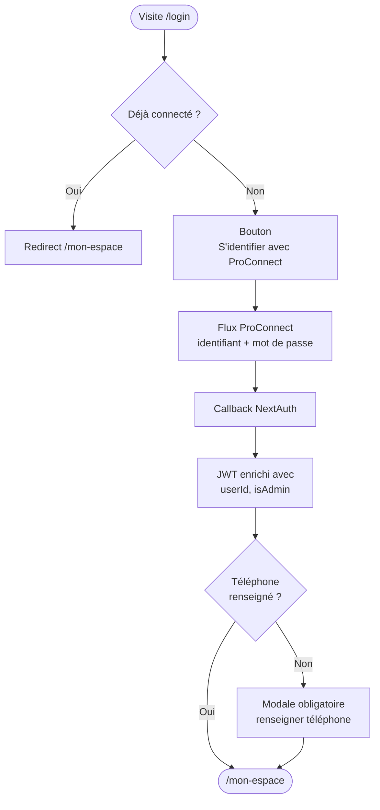
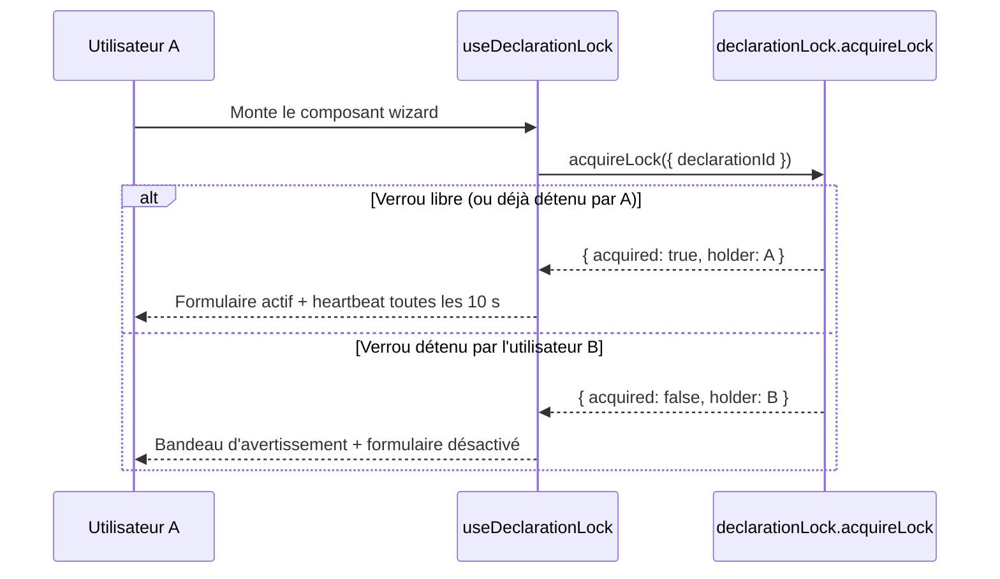
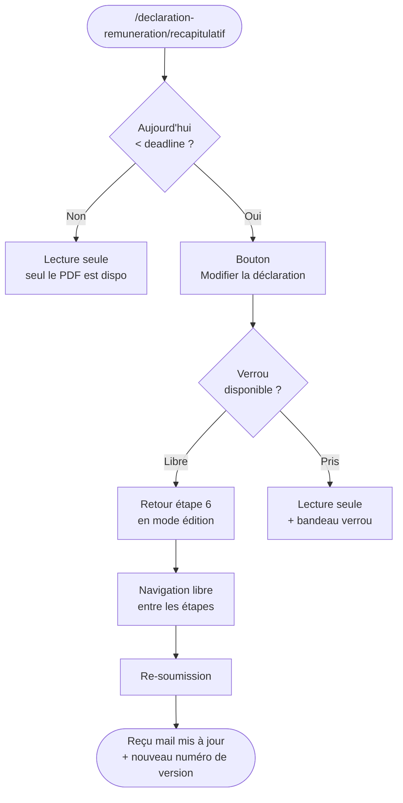
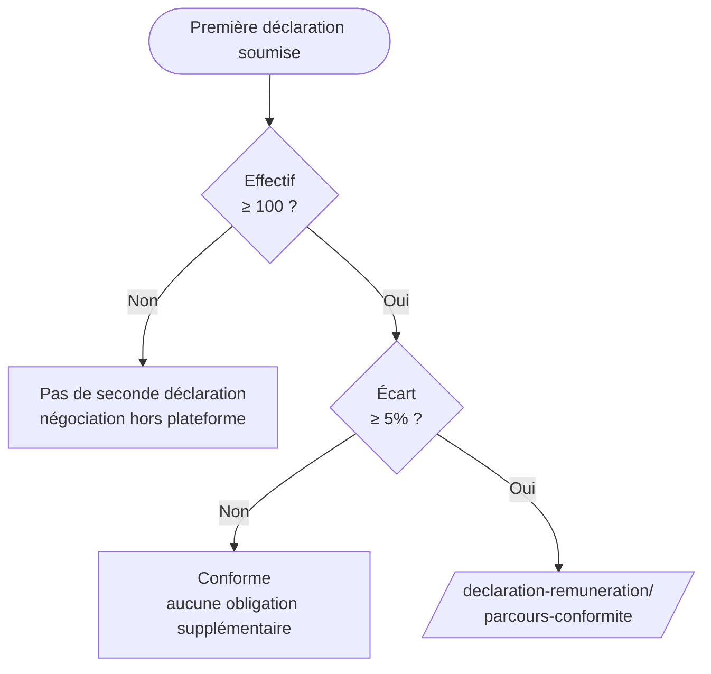
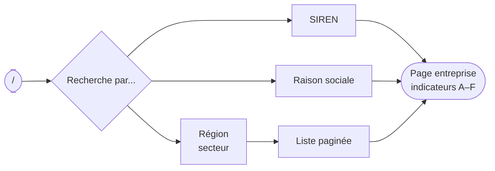
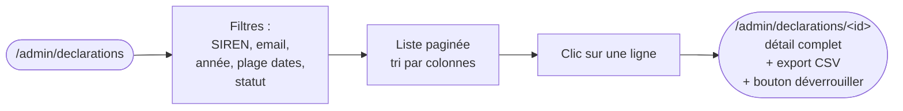
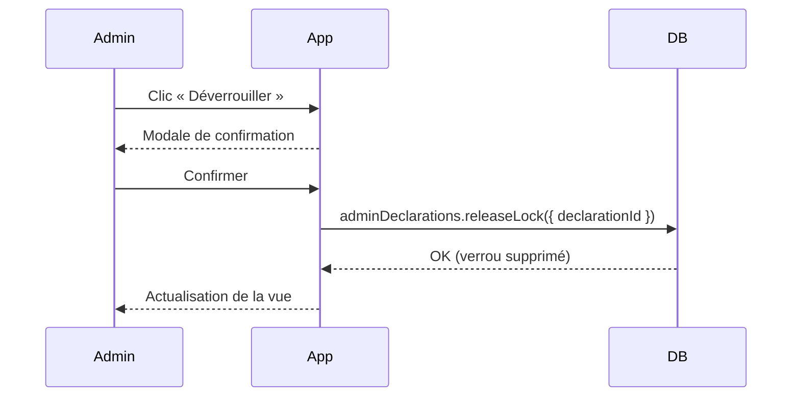
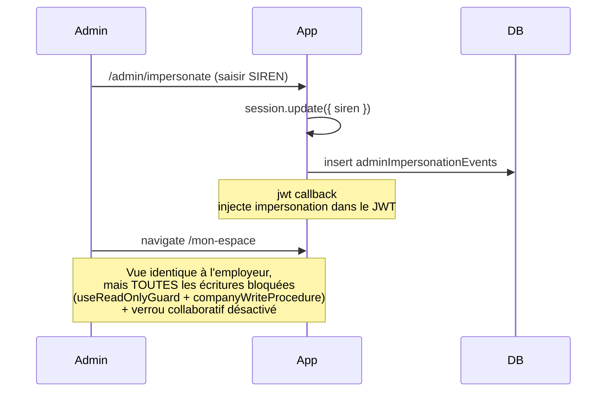

# Parcours utilisateurs EGAPRO V2

Vue d'ensemble des **flux end-to-end** suivis par chaque type d'utilisateur sur la plateforme.

Audience : équipe métier / PO (référence pour les tests d'acceptance, les revues UX, et la priorisation) et nouveaux développeurs (pour situer le code derrière chaque écran).

> Ce document complète [`docs/features.md`](features.md) (vue par feature) et [`docs/architecture.md`](architecture.md) (mécanismes techniques). Ici on raconte **ce que fait l'utilisateur**, pas comment c'est implémenté.

## Sommaire

1. [Personas](#1-personas)
2. [Parcours commun — connexion ProConnect](#2-parcours-commun--connexion-proconnect)
3. [Employeur — première déclaration de l'index](#3-employeur--première-déclaration-de-lindex)
4. [Employeur — consulter l'historique d'une démarche](#4-employeur--consulter-lhistorique-dune-démarche)
5. [Employeur — modification d'une déclaration soumise](#5-employeur--modification-dune-déclaration-soumise)
6. [Employeur — parcours de conformité (seconde déclaration)](#6-employeur--parcours-de-conformité-seconde-déclaration)
7. [Employeur — avis du CSE](#7-employeur--avis-du-cse)
8. [Citoyen — recherche et consultation publique](#8-citoyen--recherche-et-consultation-publique)
9. [Agent administration DGT](#9-agent-administration-dgt)
10. [Tableau récapitulatif des branchements clés](#10-tableau-récapitulatif-des-branchements-clés)

Conventions :

- Les chemins en `/...` sont les URL exposées par l'app.
- Les **encadrés "Pourquoi"** donnent la motivation métier (ce qui justifie une étape supplémentaire).
- Les diagrammes Mermaid décrivent les flux non triviaux (branchements ≥ 3).

---

## 1. Personas

### 1.1 Employeur déclarant

**Qui** : DRH, responsable RH, ou dirigeant d'une entreprise française avec au moins un salarié.

**Objectif principal** : remplir la déclaration annuelle de l'index égalité dans les délais réglementaires.

**Connaissance préalable supposée** : familier avec les concepts RH (catégories de salariés, tranches de rémunération, CSE), pas forcément à l'aise avec les outils numériques.

**Contraintes courantes** :

- Données réparties entre plusieurs interlocuteurs (paie, comptabilité, CSE)
- Période de déclaration concentrée sur quelques mois (mars–septembre)
- Risque d'erreur sur les chiffres → besoin de pouvoir **modifier** après soumission
- Plusieurs personnes peuvent avoir accès à la même déclaration (co-déclarants du même SIREN) → **verrou collaboratif** pour éviter les conflits

### 1.2 Citoyen / journaliste / contrôleur

**Qui** : grand public, journalistes, syndicats, agents publics qui veulent **consulter** les données déclarées.

**Objectif principal** : trouver les indicateurs A–F d'une entreprise donnée (ou d'un secteur).

**Connaissance préalable supposée** : aucune. L'interface doit être self-explanatory.

**Contraintes** : pas d'authentification, pas de compte. Toute friction (CAPTCHA, etc.) bloque l'usage.

### 1.3 Agent administration DGT / DREETS

**Qui** : agent du Ministère du Travail (DGT au niveau national, DREETS en région) avec un compte ProConnect rattaché à un domaine `gouv.fr` et le flag `users.isAdmin = true`.

**Objectif principal** : suivre l'avancement des déclarations, dépanner les entreprises, paramétrer les deadlines de campagne, exploiter les données pour les rapports annuels.

**Connaissance préalable supposée** : haute — connaît la réglementation, les indicateurs, les seuils.

### 1.4 Référent régional (consulté, pas utilisateur de l'app)

**Qui** : agent de l'inspection du travail rattaché à une région ou un département, dont les coordonnées sont publiées sur EGAPRO.

**Objectif** : être joignable par les entreprises déclarantes via l'annuaire `/referents`. Le référent **n'utilise pas l'app** activement (sauf en tant qu'agent admin) ; il en est l'objet.

---

## 2. Parcours commun — connexion ProConnect

Tout parcours authentifié commence par une connexion ProConnect.



**Étapes** :

1. L'utilisateur arrive sur `/login` (ou est redirigé depuis une page protégée).
2. S'il a déjà une session valide, il est immédiatement redirigé vers `/mon-espace`.
3. Sinon : un bouton **« S'identifier avec ProConnect »** ouvre le flux OAuth/OIDC du SSO de l'État.
4. Au retour, NextAuth valide le token, upsert l'utilisateur en BDD, et enrichit le JWT.
5. Au premier accès à `/mon-espace`, si la table `profile` ne contient pas de ligne pour l'utilisateur, une **modale obligatoire** demande son numéro de téléphone (champ requis).

> **Pourquoi le téléphone obligatoire ?** Permet à l'administration DGT/DREETS de joindre rapidement le déclarant en cas de problème (déclaration manifestement erronée, demande de pièce justificative).

**En environnement local** : le fournisseur de test ProConnect est **FIA1V2**. Identifiants : `test@fia1.fr` (sans mot de passe).

---

## 3. Employeur — première déclaration de l'index

C'est le parcours principal de l'application, et le plus long.

### 3.1 Vue d'ensemble

```mermaid
flowchart LR
    A([/mon-espace]) --> B[Choix entreprise]
    B --> LockCheck{Verrou<br/>disponible ?}
    LockCheck -->|Libre| C[/declaration-remuneration/]
    LockCheck -->|Pris par<br/>un autre| C2[/declaration-remuneration/<br/>lecture seule]
    C --> D[Étape 1<br/>Effectifs F/H]
    D --> E[Étape 2<br/>Indicateurs A et C]
    E --> F[Étape 3<br/>Indicateurs B, D, E]
    F --> G[Étape 4<br/>Quartiles]
    G --> H[Étape 5<br/>Catégories indicateur G<br/>optionnel]
    H --> I[Étape 6<br/>Récapitulatif]
    I --> J{Soumettre}
    J -->|Confirmer| K([Reçu par mail<br/>+ PDF de déclaration])
    J -->|Modifier| F
```

### 3.2 Verrou collaboratif à l'entrée du wizard

Dès l'entrée dans le wizard, le hook `useDeclarationLock` tente d'acquérir le verrou d'édition :



Si le verrou est détenu par un autre utilisateur, un bandeau `fr-alert--warning` indique l'identité du détenteur (prénom, nom, email) et tous les formulaires sont en lecture seule (les boutons de soumission sont masqués via `LockContext`).

Le verrou est **libéré automatiquement** :
- À la fermeture ou navigation hors du wizard (unmount React)
- À la fermeture de l'onglet (`pagehide` → `navigator.sendBeacon`)
- À la déconnexion (`GET /api/auth/logout` libère tous les verrous de l'utilisateur)
- Après `DEFAULT_LOCK_TIMEOUT_MINUTES` minutes d'inactivité (configurable par l'admin DGT)

### 3.3 Étapes détaillées

| Étape | URL | Saisie | Calculé / dérivé |
|---|---|---|---|
| 1 | `/declaration-remuneration/etape/1` | Effectifs hommes / femmes | — |
| 2 | `/declaration-remuneration/etape/2` | Rémunération moyenne F/H (annuel + horaire) | Indicateurs A et C |
| 3 | `/declaration-remuneration/etape/3` | Rémunération variable F/H + nombre de promotions F/H | Indicateurs B, D, E |
| 4 | `/declaration-remuneration/etape/4` | Pour 4 quartiles × 2 (annuel + horaire) : seuil + effectifs F/H | Indicateur F |
| 5 | `/declaration-remuneration/etape/5` | (Optionnel) Liste de catégories d'emploi avec rémunération de base + variable F/H | Indicateur G |
| 6 | `/declaration-remuneration/etape/6` | Validation finale | — |

À chaque étape, **chaque clic "Suivant"** sauvegarde l'état en base de données (`status = draft`, `currentStep` mis à jour) — à condition que le verrou soit bien détenu par l'utilisateur (le serveur rejette sinon avec `CONFLICT`). L'utilisateur peut fermer le navigateur et reprendre plus tard.

### 3.4 Pré-remplissage GIP-MDS

Si le GIP-MDS a publié les indicateurs A–F pour ce SIREN et cette année (table `gipMdsData`, alimentée par l'admin via import CSV manuel), les valeurs sont **pré-remplies** dans les étapes 2 à 4. L'employeur peut **écraser** ces valeurs (le pré-remplissage n'est pas verrouillé).

> **Pourquoi écrasable ?** Le calcul GIP est basé sur les DSN, qui peuvent contenir des erreurs (mauvais codage CSP, période incomplète). L'employeur reste responsable légalement, donc il doit pouvoir corriger.

### 3.5 Soumission

À l'étape 6, le clic sur **« Soumettre »** :

1. Bascule la déclaration en `status = submitted` et fige le snapshot `cseRequired`.
2. Calcule le `remunerationScore` final.
3. Envoie un **mail de reçu** à l'utilisateur avec le numéro de soumission, l'année, et un lien vers le récap PDF.
4. Redirige vers `/declaration-remuneration/recapitulatif/` (vue lecture seule).

**Contrôles bloquants** au moment de la soumission :

- Cohérence des effectifs (somme F + H = effectif total)
- Plafond de déclarations par année (`MAX = 2`, mais cas rare à ce stade)
- Aucun champ obligatoire vide (les optionnels comme l'indicateur G sont laissés vides si non saisi)

### 3.6 Sorties possibles

- **Soumission OK** → recap PDF + reçu mail
- **Abandon en cours** → brouillon en base, disparaît automatiquement au-delà de **2 mois** sans modification (cleanup)
- **Erreur métier bloquante** → message inline, retour à l'étape concernée
- **Verrou perdu pendant la saisie** (expiration ou reprise par un tiers) → le prochain "Suivant" reçoit un `CONFLICT`, l'utilisateur doit recharger la page
- **Bascule vers parcours conformité** : si l'écart calculé ≥ 5% **et** entreprise ≥ 100 salariés, l'écran de confirmation propose le parcours de conformité (cf. §6)

### 3.7 État du verrou dans l'espace personnel

Sur `/mon-espace`, le panneau latéral de la démarche (`DeclarationProcessPanel`) affiche un bandeau `fr-alert--warning` si une autre session détient le verrou au moment du chargement de la page. Le bouton CTA est libellé **« Consulter en lecture seule »** au lieu de « Commencer » ou « Continuer ».

---

## 4. Employeur — consulter l'historique d'une démarche

Depuis l'espace personnel, l'employeur peut suivre la **chronologie complète** des actions effectuées sur sa démarche pour une année donnée : qui a fait quoi, quand, et sur quelle page.

```mermaid
flowchart TD
    A([/mon-espace]) --> B[Panneau de la démarche<br/>lien « Voir l'historique »]
    B --> C[/mon-espace/historique/&lt;siren&gt;/&lt;year&gt;]
    C --> D{Rattaché à<br/>l'entreprise ?}
    D -->|Non| E[Accès refusé]
    D -->|Oui| F[Liste chronologique<br/>récent → ancien]
    F --> G{Plus de<br/>10 entrées ?}
    G -->|Oui| H[Bouton « Voir plus »<br/>charge la page suivante]
    G -->|Non| I[Liste complète]
    H --> F
```

### 4.1 Point d'entrée

Le lien **« Voir l'historique »** se trouve dans le panneau latéral de la démarche sur `/mon-espace` (`DeclarationProcessPanel`). Il mène à `/mon-espace/historique/<siren>/<year>`.

### 4.2 Contenu de la page

Pour chaque action de la démarche, une entrée affiche :

- la **date et l'heure** de l'action (format français)
- l'**auteur** (nom + email ; « Système » si l'action n'a pas d'auteur identifié)
- le cas échéant, un lien **« Page : … »** vers l'écran concerné par l'action

Les entrées sont triées **du plus récent au plus ancien**. La liste se charge par tranches de 10 ; un bouton **« Voir plus »** charge la suite tant qu'il reste des entrées.

### 4.3 Actions tracées

Sont consignés : les changements d'étape du wizard, la soumission de la déclaration, le choix du parcours de conformité, la soumission de la seconde déclaration, le dépôt de l'évaluation conjointe, le dépôt de l'avis CSE, l'annulation et la finalisation de la démarche.

### 4.4 Accès et confidentialité

- L'accès est **réservé** : l'utilisateur doit être rattaché à l'entreprise (table `userCompanies`). Un agent admin en impersonation sur le SIREN concerné y a également accès.
- La page exige une session (sinon redirection vers `/login`) et valide les paramètres d'URL (SIREN de 9 caractères, année ≥ 2018).
- La consultation est **auditée** comme lecture sensible (catégorie `read_sensitive`, action `declaration_history.read`) car elle expose des données nominatives (auteurs des actions).

> **Pourquoi un historique ?** La démarche peut s'étaler sur plusieurs mois et impliquer plusieurs personnes (RH, paie, CSE). L'historique permet à l'employeur de savoir précisément qui est intervenu et quand, utile en cas de contrôle ou de transmission interne du dossier.

---

## 5. Employeur — modification d'une déclaration soumise

Tant que la **deadline de modification** (`decl1ModificationDeadline`, configurée par l'admin DGT par année) n'est pas atteinte, l'employeur peut **rouvrir** sa déclaration.



> **Pourquoi une deadline ?** L'administration doit pouvoir publier des chiffres stables à un moment donné. La deadline de modification est paramétrable par campagne pour s'adapter aux décisions politiques (extension, urgence sanitaire, etc.).

**Note importante** : la modification ne crée **pas** une nouvelle déclaration ; elle écrase la précédente. Pour ajouter une seconde déclaration (cas écart ≥ 5%), c'est un parcours dédié (cf. §6).

---

## 6. Employeur — parcours de conformité (seconde déclaration)

Réservé aux entreprises **≥ 100 salariés** dont l'**écart calculé est ≥ 5%**. Vise à matérialiser la **mise en conformité** : nouvelle déclaration sous 6 mois et, optionnellement, dépôt d'un document d'évaluation conjointe.

### 6.1 Conditions d'accès



### 6.2 Étapes du parcours conformité

| Étape | URL | Contenu |
|---|---|---|
| Choix du chemin | `/parcours-conformite/` | Sélection du chemin de conformité (enum `COMPLIANCE_PATHS`) |
| 1 à 4 | `/parcours-conformite/etape/[1..4]` | Mêmes structures que la première déclaration (effectifs, A/C, B/D/E, quartiles) |
| Évaluation conjointe | `/parcours-conformite/evaluation-conjointe` | Upload optionnel d'un PDF d'évaluation conjointe |
| Confirmation | `/parcours-conformite/confirmation` | Page finale après soumission |

### 6.3 Règles métier

- **Période de référence flexible** : entre la date de première déclaration et le 31 décembre de l'année courante.
- **Maximum 2 déclarations par année civile** (la première initiale + la corrective).
- **Évaluation conjointe optionnelle** : un seul fichier par déclaration (le re-upload écrase). PDF uniquement, scanné par ClamAV avant stockage.
- Le **choix de parcours est verrouillé** dès qu'une action aval a été enregistrée pour le round courant.
- Plusieurs deadlines admin (toutes configurables, par année) :
  - `decl2ModificationDeadline` — modification de la seconde déclaration
  - `JustificationDeadline` — délai de justification
  - `JointEvaluationDeadline` — délai pour l'évaluation conjointe

### 6.4 Sortie

À la confirmation, mail de reçu + retour à `/mon-espace` avec le statut **« seconde déclaration soumise »** affiché sur la fiche entreprise.

---

## 7. Employeur — avis du CSE

Réservé aux entreprises **≥ 100 salariés** (le CSE est obligatoire à partir de ce seuil).

```mermaid
flowchart LR
    A([/mon-espace<br/>fiche entreprise]) --> B[/avis-cse/etape/1]
    B --> C[Saisir les avis<br/>première déclaration<br/>+ optionnellement seconde]
    C --> D[/avis-cse/etape/2]
    D --> E[Upload PDF<br/>jusqu'à 4/an]
    E --> F{Fichiers uploadés ?}
    F -->|Oui| M[Matrice d'association<br/>fichier × type de contenu]
    M --> G{Toutes les colonnes<br/>associées ?}
    G -->|Non| M
    G -->|Oui| H[Bouton Finaliser]
    H --> I([Confirmation<br/>+ mail])
```

### 7.1 Saisie de l'étape 1 (avis textuels)

Pour la première déclaration (et optionnellement la seconde), deux avis :

- **Avis sur l'exactitude** des données — favorable / défavorable + date
- **Avis sur les écarts** — favorable / défavorable + date
  - Si l'avis sur les écarts n'a **pas été consulté** par le CSE, on coche `gapConsulted = false` et l'avis est nullable

### 7.2 Étape 2 — upload des PDF et association des types de contenu

Limite : **4 PDF par année** (`MAX_CSE_FILES = 4`). Chaque fichier passe par :

1. Validation côté client (PDF, taille max)
2. Validation Zod côté serveur (mime + taille)
3. **Scan ClamAV** (rejeté si infecté, jamais stocké)
4. Upload S3 (clé `<siren>/<year>/cse_opinion/<uuid>.pdf`)
5. Insertion en base (`files` table)

Dès qu'au moins un fichier est uploadé, la **matrice d'association** (`ContentTypeMatrix`) s'affiche. Elle comporte une colonne par type de contenu requis :

| Colonne | Présente si… |
|---|---|
| Exactitude — 1re déclaration | toujours |
| Justification des écarts — 1re déclaration | `gapConsulted = true` pour la 1re déclaration |
| Exactitude — 2e déclaration | seconde déclaration présente |
| Justification des écarts — 2e déclaration | seconde déclaration présente + `gapConsulted = true` |

Pour chaque ligne (fichier) × colonne (type de contenu), une **case à cocher** permet d'associer le fichier au type. Une colonne ne peut être associée qu'à un seul fichier à la fois.

### 7.3 Finalisation

Le clic sur **« Soumettre »** (quand toutes les associations sont présentes) :

1. Ouvre une modale de confirmation (`SubmitConfirmationModal`).
2. Déclenche la procédure `finalize` qui vérifie côté serveur que :
   - au moins un avis CSE est enregistré
   - au moins un fichier est uploadé
   - chaque couple `(declarationNumber, type)` requis est couvert par une association dans `cseOpinionFiles`
3. Bascule la déclaration en `cseStatus = submitted` et enregistre l'événement dans `declarationStatusHistory`.
4. Redirige vers `/avis-cse/confirmation`.

> **Pourquoi cette séparation déclaration / CSE ?** Le calendrier de mise au CSE est différent : il faut d'abord déclarer les indicateurs, puis attendre la convocation du CSE, faire passer en réunion, déposer le PV. Ces deux temps peuvent s'étaler sur plusieurs semaines.

---

## 8. Citoyen — recherche et consultation publique

Public, sans authentification. Très peu de friction.

### 8.1 Parcours simple



### 8.2 Données exposées

Pour chaque entreprise déclarante :

- Identité (SIREN, raison sociale, NAF, taille)
- **Indicateurs A à F** uniquement
  - L'**indicateur G reste confidentiel** (catégories d'emploi définies par l'entreprise)
  - Les fichiers (CSE, évaluation conjointe) ne sont **pas** exposés au public

### 8.3 Export Excel et API publique

Pour les analystes / journalistes / chercheurs :

| URL | Format | Usage |
|---|---|---|
| `/api/export/declarations?year=2024` | XLSX | Toutes les déclarations d'une année |
| `/api/export/declarations?date_begin=2024-01-01&date_end=2024-12-31` | XLSX | Plage de dates |
| `/export?swagger=1` | Swagger UI | Documentation interactive |

Aucune authentification requise. Les téléchargements sont audités (catégorie `export`, rétention 365 jours).

### 8.4 Annuaire des référents

`/referents` permet aux entreprises de trouver leur **interlocuteur DREETS / inspection du travail**.

- Liste paginée par région / département
- Fiche détaillée révélée **au clic** sur la ligne — pas de coordonnées en bulk dans la liste (anti-scraping)

---

## 9. Agent administration DGT

Les agents admin DGT/DREETS arrivent sur `/admin/` après connexion (le middleware Edge garantit `isAdmin === true`).

### 9.1 Tableau de bord

`/admin/` propose des raccourcis vers les sous-sections :

- Recherche de déclarations
- Liste des référents
- Impersonation
- Paramètres de campagne + délai du verrou
- Stats de campagne

### 9.2 Recherche de déclarations



Tous les appels sont audités (`ADMIN_DECLARATIONS_SEARCH`, `ADMIN_DECLARATION_GET_BY_ID`).

### 9.3 Déverrouillage manuel d'une déclaration

Sur la page de détail d'une déclaration (`/admin/declarations/<id>`), si un verrou actif est détenu par un utilisateur, l'admin voit le bouton **« Déverrouiller »** :



> **Pourquoi ce déverrouillage manuel ?** Si un co-déclarant ferme son navigateur sans libérer le verrou (crash, perte réseau) et que le délai d'expiration n'est pas encore atteint, une autre personne de l'entreprise peut se retrouver bloquée. L'admin peut débloquer la situation sans attendre l'expiration.

### 9.4 Impersonation

Pour dépanner une entreprise (problème de saisie, incompréhension), l'agent peut **incarner** un compte employeur :



**Garanties** :

- L'impersonation est **lecture seule** : aucune mutation possible côté front (read-only guard) ni côté back (rejet des `companyWriteProcedure`).
- Le verrou collaboratif est **désactivé** : le hook `useDeclarationLock` ne tente pas d'acquérir de verrou (impersonation détectée via `session.data.user.impersonation`).
- L'événement est tracé dans `adminImpersonationEvents`.
- L'audit log capture l'agent admin **et** le SIREN incarné.

> **Pourquoi cette double protection ?** Une mutation accidentelle d'un agent admin sur le compte d'une entreprise serait juridiquement très problématique (l'admin signerait à la place du déclarant). La règle « jamais d'écriture en impersonation » est inviolable.

### 9.5 Gestion des référents

`/admin/liste-referents` — CRUD complet :

- Recherche par région / département
- Création / édition / suppression à l'unité
- **Import CSV** en masse (upsert basé sur région + département + nom)

### 9.6 Paramétrage des deadlines de campagne et du verrou

`/admin/parametres` — deux sections :

**Deadlines de campagne** (par année) :

| Champ | Rôle |
|---|---|
| `gipPublicationDate` | Date de publication des données GIP-MDS (lecture seule, vient du CSV importé) |
| `campaignStartDate` | Date d'ouverture de la campagne |
| `decl1ModificationDeadline` | Date limite pour modifier une première déclaration |
| `decl2ModificationDeadline` | Date limite pour modifier une seconde déclaration |
| `JustificationDeadline` | Date limite pour les justifications |
| `JointEvaluationDeadline` | Date limite pour l'évaluation conjointe |

Si une année n'a pas de ligne en BDD, des **valeurs par défaut** sont calculées par `getDefaultCampaignDeadlines(year)` dans `~/modules/domain`.

**Délai d'expiration du verrou** (global, toutes campagnes) :

| Champ | Rôle |
|---|---|
| `timeoutMinutes` | Durée en minutes après laquelle un verrou inactif expire (1–1440, défaut 30) |

Stocké dans `globalSettings.declarationLockTimeoutMinutes`, mis à jour via `adminSettings.updateLockTimeout` (audit `ADMIN_SETTINGS_UPDATE_LOCK_TIMEOUT`).

### 9.7 Statistiques de campagne

`/admin/stats/campagne` — courbes cumulatives de soumission par jour, **segmentées par tranche d'effectif** (`small / medium / large`, voir `COMPANY_SIZE_RANGES`).

### 9.8 Import GIP-MDS

Bouton sur la home admin → mutation tRPC `gipMds.importFromUrl` qui :

1. Fetch le CSV depuis `EGAPRO_GIP_MDS_API_URL`
2. Parse et upsert dans `gipMdsData` (clé `siren + year`)
3. Retourne le nombre de lignes traitées

L'agent fait cet import **manuellement** une fois par campagne, après publication officielle par le GIP-MDS (chaque année en mars).

---

## 10. Tableau récapitulatif des branchements clés

Pour les arbitrages de spec et la priorisation, ces décisions sont les plus structurantes :

| Branchement | Critère | Conséquence |
|---|---|---|
| Déclaration obligatoire ? | Effectif | < 50 : volontaire / 50–99 : annuel (6 indicateurs uniquement) / 100+ : annuel (tous) |
| Indicateur G obligatoire ? | Effectif | < 50 : non / 50–249 : triennal / 250+ : annuel |
| Avis CSE applicable ? | Effectif | < 100 : interdit / ≥ 100 : obligatoire |
| Seconde déclaration applicable ? | Écart calculé + effectif | ≥ 5% **et** ≥ 100 salariés → parcours conformité |
| Modification possible ? | Date du jour vs deadline | < deadline : oui / ≥ deadline : lecture seule |
| Pré-remplissage disponible ? | Présence dans `gipMdsData` | Oui = champs A–F pré-remplis (écrasables) |
| Accès à l'historique d'une démarche ? | Rattachement entreprise | Oui si rattaché (ou admin en impersonation) — sinon refusé |
| Impersonation : écriture ? | Toujours | Non — lecture seule garantie, verrou désactivé |
| Impersonation : verrou ? | Toujours | Désactivé — l'admin ne peut pas détenir de verrou |
| Indicateur G publié ? | Toujours | Non — confidentialité par construction |
| Files (CSE / évaluation) publiés ? | Toujours | Non — accessibles uniquement à l'employeur et à l'admin |
| Verrou d'édition disponible ? | Détenu par une autre session active | Non → wizard en lecture seule + bandeau |
| Verrou expiré ? | `expiresAt` dépassé | Traité comme libre (acquisition possible) |
| Déverrouillage forcé ? | Admin uniquement | Possible depuis `/admin/declarations/<id>` |

---

## Pour aller plus loin

- **Features** (vue par feature) : [`docs/features.md`](features.md)
- **Architecture** (mécanismes techniques) : [`docs/architecture.md`](architecture.md)
- **Spécifications réglementaires** : [wiki Spec V2](https://github.com/SocialGouv/egapro/wiki/Spec-V2)
- **README racine** (contexte légal et obligations par taille) : [`README.md`](../README.md)
